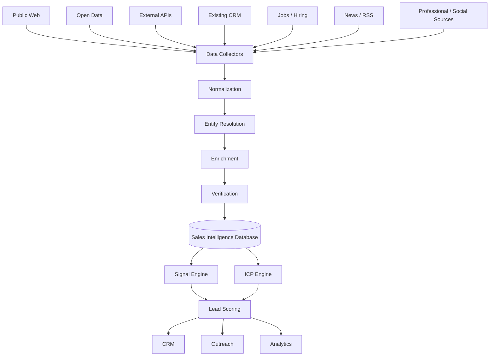
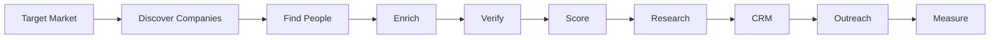
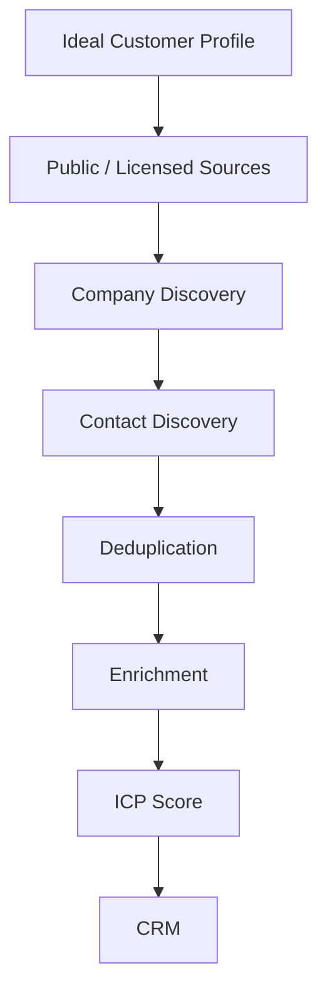
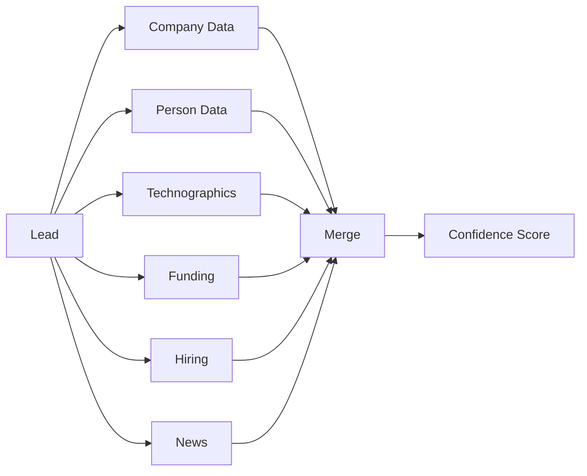
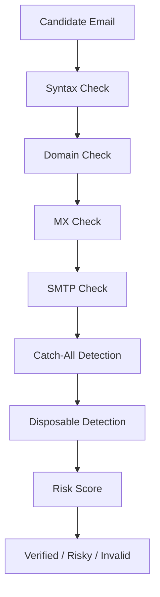
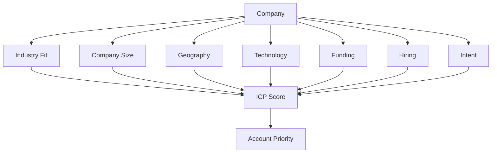
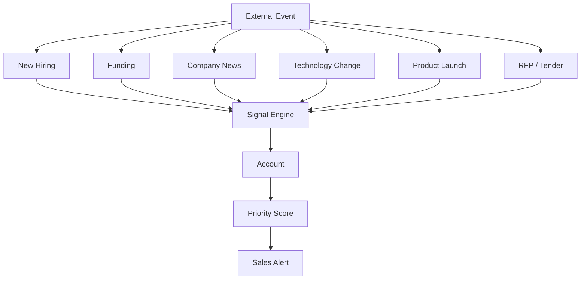
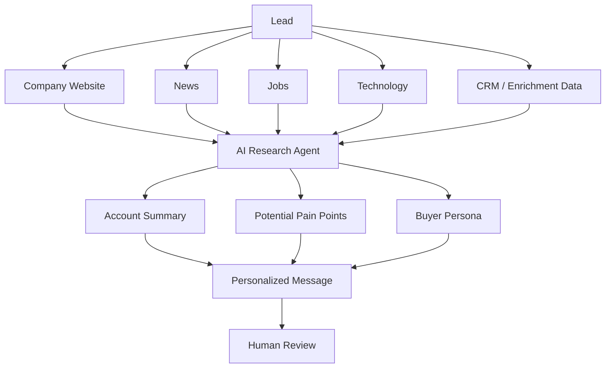
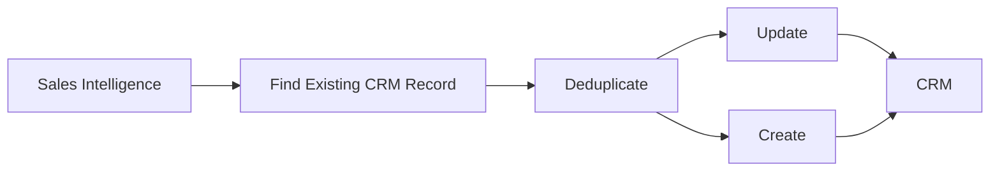

<div align="center">



# 🚀 Awesome Sales Intelligence

**A curated directory of top B2B sales intelligence platforms, prospecting tools, lead enrichment engines, contact discovery databases, intent signal trackers, and open-source GTM infrastructure.**

<!-- Badges Section -->
<a href="https://github.com/ishandutta2007/Awesome-Awesome-Awesome"></a><a href="https://discord.gg/jc4xtF58Ve"></a>
<a href="https://github.com/ishandutta2007/Awesome-Sales-Intelligence/stargazers"></a>
<a href="https://github.com/ishandutta2007/Awesome-Sales-Intelligence/network/members"></a>
<a href="https://github.com/ishandutta2007/Awesome-Sales-Intelligence/blob/main/LICENSE"></a>
<a href="https://github.com/ishandutta2007/Awesome-Sales-Intelligence/pulls"></a>
<a href="https://github.com/ishandutta2007"></a>

<p align="center">
  <b>Last updated: September 2026</b> • Maintained by <a href="https://github.com/ishandutta2007">@ishandutta2007</a>
</p>

</div>

---

## 🔍 Overview & SEO Guide

Welcome to the **Awesome Sales Intelligence** repository! 🚀 In 2026, modern B2B go-to-market (GTM) strategy requires moving beyond static, stale contact lists. High-performing outbound sales teams, revenue operations (RevOps) engineers, and growth hackers rely on dynamic **waterfall enrichment**, **real-time intent signals**, **AI-assisted account research**, and **resilient self-hosted data infrastructure**.

Whether you are evaluating category-leading SaaS giants (like **ZoomInfo, Apollo.io, Clay, 6sense, Cognism, and Lusha**) or building a 100% self-hosted, privacy-first alternative with open-source software (**Twenty, n8n, Firecrawl, Crawl4AI, Ollama, and OpenLeads**), this guide indexes both worlds ranked by commercial scale and GitHub_Stars.

### 🎯 Key Sales Intelligence Pillars:
* **🎯 B2B Contact Discovery & Lead Finding:** Discovering verified corporate email addresses, direct-dial phone numbers, LinkedIn profiles, and verified decision-maker titles across target accounts.
* **🔍 Waterfall Lead Enrichment & Data Normalization:** Cascading multi-provider APIs to enrich company firmographics (headcount, revenue, industry), technographics (installed software stack), and social profiles without vendor lock-in.
* **📡 Intent & Buying Signal Detection:** Monitoring high-intent buying triggers including job postings, executive leadership changes, funding announcements, tech-stack migrations, GitHub_Stars, and anonymous website visitor IP de-anonymization.
* **🤖 AI Agentic Prospect Research:** Autonomous LLM-driven research agents that parse company websites, 10-K filings, press releases, and podcast transcripts to synthesize bespoke prospect pain points and hyper-personalized outreach angles.
* **🔄 CRM Synchronization & Automated Outreach:** Bi-directional real-time sync into open-source or commercial CRMs with automated email cadences, deliverability warm-up, and multi-channel sequencing.

---
## 📑 Table of Contents

* [🏢 SaaS / Hosted Platforms](#saashosted-platforms)
* [⭐ Open-Source GitHub Projects (Ranked by Stars)](#-open-source-github-projects-ranked-by-stars)
* [🎯 Open-Source Direct Sales Intelligence Platforms](#-open-source-sales-intelligence-platforms)
* [🕸️ Open-Source Web Scraping & Data Extraction Engines](#-open-source-web--data-extraction)
* [📇 Open-Source CRM & Sales Pipeline Systems](#-open-source-crm-platforms)
* [🔎 Open-Source OSINT & Contact Finding Tools](#-open-source-osint--contact-discovery)
* [✉️ Open-Source Email Discovery & Verification Infrastructure](#-open-source-email-discovery--verification)
* [⚡ Open-Source Workflow & GTM Automation](#-open-source-workflow--gtm-automation)
* [🤖 Open-Source AI Sales Research & LLM Agents](#-open-source-ai-sales-research)
* [📊 Open-Source Analytics & Data Infrastructure](#-open-source-analytics--data-infrastructure)
* [💡 Commercial Platform → Open-Source Equivalents](#-commercial-platform--open-source-equivalents)
* [🏗️ Frameworks for Custom Sales Intelligence](#-frameworks-for-building-custom-sales-intelligence-platforms)
* [🏛️ Reference Architecture](#-reference-architecture)
* [🔄 Sales Intelligence Workflows](#-typical-sales-intelligence-workflow)
* [📈 Star History](#-star-history)
* [🤝 How to Contribute](#-how-to-contribute)
* [⚖️ Disclaimer](#-disclaimer)

---

---


# 🏢 SaaS/Hosted Platforms


These are commercial, hosted or enterprise-oriented sales-intelligence and prospecting platforms.

> **Market Size & Industry Dynamics:** The global sales intelligence market is estimated at **$4.4B – $5.0B in 2026** (projected to surpass **$10B+ by 2032** at an 11.5% CAGR). The sector is **moderately fragmented with a barbell distribution**: anchored by legacy enterprise giants (ZoomInfo, 6sense, Demandbase) and rapid-growth modern data unbundlers (Clay, Apollo), balanced against dozens of specialized vertical data providers, intent networks, and scraping utilities rather than a winner-take-all monopoly.

Below is a curated comparison of category-leading Sales Intelligence and B2B Prospecting SaaS platforms, **sorted by estimated company scale / revenue / valuation (descending)**:

| Platform | Company Scale / Valuation | Primary Model | Main Strength | Pricing | Free Tier / Free Trial Limits |
| :--- | :--- | :--- | :--- | :--- | :--- |
| [ZoomInfo](https://www.zoominfo.com/) | **~$1.26B Revenue** (~$1.23B Market Cap, NASDAQ: ZI / GTM) | Enterprise sales intelligence | Large B2B data + intent | **$14,995/year** (Professional plan, 1–3 seats; annual contract required) | **ZoomInfo Lite**: Forever-free plan with 10 credits/month (or 25 credits/month with Community contact sharing); **7-day free trial** with ~200 credits upon demo request |
| [Clay](https://www.clay.com/) | **$7.1B Valuation** (~$200M+ Annualized Revenue, Series B) | Data enrichment | Multi-provider enrichment workflows | **$149/month** ($134/month billed annually) for Starter plan (2,000 credits/month) | **Forever-free plan**: 100 Data Credits/month and 500 Actions/month, 1 user seat (plus 14-day free trial with 1,000 credits on paid plans) |
| [6sense](https://6sense.com/) | **$5.2B Valuation** (~$265M ARR, Series E) | Intent/ABM & predictive intelligence | Buying signals + account intelligence + predictive ABM | **~$10,000/year** (Revenue AI / Sales Intelligence starter tier for small teams; enterprise ABM contracts typically $60,000+/year) | **Forever-free plan**: 50 data credits/month, Buyer Discovery, company and contact lookup, and Chrome extension |
| [Apollo](https://www.apollo.io/) | **$1.6B Valuation** (~$150M+ ARR, Series D) | Prospecting + engagement | Database + outbound sequencing | **$59/user/month** ($49/user/mo billed annually) for Basic plan | **Forever-free plan**: 10 export credits/month, 5 mobile credits/month, unlimited email reveals (capped at 250 emails/day), and 2 active sequences (plus 14-day free trial on paid plans) |
| [Lusha](https://www.lusha.com/) | **$1.5B Valuation** (~$80M+ ARR, Series B) | Prospecting | Contact/company enrichment | **$49.90/user/month** ($37.45/user/mo billed annually) for Starter plan (4,800 credits/year) | **Forever-free plan**: 40 credits/month, 1 user seat, Chrome extension, and basic prospecting filters (1 credit/email, 5 credits/phone) |
| [Demandbase](https://www.demandbase.com/) | **~$1B+ Est. Valuation** (>$200M Annual Revenue) | ABM intelligence | Account identification + intent | **~$24,000/year** (~$2,000/month, annual commitment for entry ABM platform) | **Demandbase One Account ID Free Edition**: Identifies website account visitors for up to 5,000 monthly unique visitors; or **30-day proof-of-concept trial** via sales demo |
| [Similarweb](https://www.similarweb.com/) | **~$750M Market Cap** (~$240M+ Revenue, NYSE: SMWB) | Web intelligence | Traffic + digital signals | **$199/month** ($125/month billed annually at $1,500/year) for Starter plan (1 seat, 3 months historical traffic data) | **7-day free trial**: Capped at 15 actions/day and 3 months historical data; plus free browser extension for basic traffic overview |
| [Cognism](https://www.cognism.com/) | **~$500M+ Valuation** (~$80M+ ARR, Series C) | B2B intelligence | Global contact data + phone intelligence | **~$15,000/year** (Grow plan base platform fee ~$1,500/user/year; annual contract required) | **Free trial**: 25–50 verified B2B contact leads provided during a guided proof-of-concept / demo call (no permanent free tier) |
| [Common Room](https://www.commonroom.io/) | **~$350M Valuation** (~$15M+ ARR, Series B) | GTM intelligence | Product/community signals | **$2,500/month** (billed annually at $30,000/year) for Essential plan (5 seats, 100,000 contacts, 2,500 prospector credits) | **14-day free trial**: Guided sandbox trial with up to 500 prospector credits via sales demo (legacy free plan retired) |
| [Crunchbase](https://www.crunchbase.com/) | **~$300M Valuation** (~$60M+ ARR) | Company intelligence | Companies + funding | **$99/user/month** ($49/user/month billed annually at $588/year) for Crunchbase Pro | **Forever-free plan**: Basic company profiles and search capped at 5 results per query; plus **7-day free trial** of Pro with full search and exports |
| [Bombora](https://bombora.com/) | **~$300M Est. Valuation** (~$60M–$80M ARR) | Intent data | B2B intent signals | **~$25,000/year** (~$2,083/month billed annually) for Company Surge Starter (up to 25 intent topics) | **14-day proof-of-concept trial**: Custom intent surge report covering up to 10 selected intent topics via sales consultation (no permanent free tier) |
| [Seamless.AI](https://seamless.ai/) | **~$250M Est. Valuation** (~$40M–$50M ARR) | Contact intelligence | Real-time contact discovery | **$147/user/month** (Basic plan, billed annually) | **Forever-free tier**: 50 lifetime contact credits upon signup (one-time allocation, non-replenishing, access to Chrome extension and search) |
| [Leadfeeder](https://www.leadfeeder.com/) | **~$180M Valuation** (€30M+ ARR / ~$33M ARR via Dealfront) | Website intelligence | Anonymous visitor identification | **€99/month** (~$105/month; €79/month billed annually at €948/year) for Discover plan (1,000 identified companies/month) | **Forever-free Lite plan**: Tracks up to the last 100 identified companies with 7 days of visitor data; plus **14-day full free trial** of premium features |
| [Clearbit](https://www.clearbit.com/) | **~$150M Acquisition** (~$50M ARR; HubSpot NYSE: HUBS ~$30B+ Cap) | Enrichment | Company/person enrichment | **$50/month** ($45/month billed annually) for 100 Breeze Intelligence enrichment credits | **14-day free trial** via HubSpot Smart CRM / Breeze Intelligence with complimentary test credits (legacy standalone free tier retired) |
| [People Data Labs](https://www.peopledatalabs.com/) | **~$150M Valuation** (~$20M ARR, Series B) | Data API | Person/company datasets | **$98/month** ($78/month billed annually at $940/year) for Pro tier (350 person enrichments/month) | **Forever-free sandbox plan**: 100 API records/month for testing and development (sensitive fields like email/phone obfuscated) |
| [LeadIQ](https://leadiq.com/) | **~$100M Valuation** (~$15M ARR, Series B) | Prospecting | LinkedIn prospecting + CRM enrichment | **$45/user/month** ($36/user/mo billed annually) for Essential plan | **Forever-free plan**: 50 Universal Credits/month, 1 user seat, and Chrome extension capture (or 30-day free trial on paid plans) |
| [BuiltWith](https://builtwith.com/) | **~$100M+ Est. Valuation** (~$14M–$20M ARR, Bootstrapped) | Technographics | Technology-stack intelligence | **$295/month** ($245.83/month billed annually at $2,950/year) for Basic plan (or $12/month / $144/year for single-site lookup Basic) | **Forever-free tier**: Unlimited single-website technology lookups via website and free API tier (1 request/sec rate limit, up to 10 lookups/day without bulk lists) |
| [Hunter](https://hunter.io/) | **~$80M+ Est. Valuation** (~$15M–$20M ARR, Bootstrapped) | Email intelligence | Email discovery + verification | **$49/month** ($34/month billed annually) for Starter plan (2,000 credits/month) | **Forever-free plan**: 50 search/verification credits/month, 1 connected email account, campaigns up to 500 recipients |
| [Dealroom](https://dealroom.co/) | **~$70M–$80M Valuation** (~$12M ARR) | Company intelligence | Startups + funding + ecosystem | **€12,000/year** (~€1,000/month billed annually) for Premium plan (10,000 export credits) | **3-day free trial** of Premium with 50 export credits (no credit card required); basic open directory preview capped at 25 results |
| [PhantomBuster](https://phantombuster.com/) | **~$70M Valuation** (~$15M ARR) | Prospecting automation | Social/web automation | **$69/month** ($56/month billed annually at $672/year) for Start plan (20 execution hours/month, 5 slots, 500 email credits) | **14-day free trial**: 2 hours execution time, 5 phantom slots, 50 email credits; downgrades to **Free plan**: 30 min execution time/month, 1 slot, 10-row export limit |
| [UpLead](https://www.uplead.com/) | **~$60M Est. Valuation** (~$12M–$18M ARR, Bootstrapped) | B2B database | Verified B2B contacts | **$99/month** ($74/month billed annually) for Essentials plan (170 credits/month) | **7-day free trial**: 5 verified contact credits, full access to search and Chrome extension (no permanent free plan) |
| [Apify](https://apify.com/) | **~$50M Valuation** (~$12M ARR, Series A) | Data extraction | Web scraping infrastructure | **$29/month** (Starter plan; includes $29 prepaid usage, 32 concurrent runs) | **Forever-free plan**: $5/month prepaid compute/platform usage credits, 25 concurrent runs, 16 GB RAM per run, and free community scrapers |
| [Adapt.io](https://www.adapt.io/) | **~$40M Est. Valuation** (~$8M–$12M ARR) | Lead database | Contact/company discovery | **$49/month** ($39/month billed annually) for Starter plan (500 email & enrichment credits/month) | **Forever-free plan**: 25 email credits/month and 25 enrichment credits/month (capped at 25 contacts/day; no CSV export) |
| [Kaspr](https://kaspr.io/) | **~$30M Acquisition** (~$8M–$12M ARR; Acquired by Cognism) | LinkedIn prospecting | LinkedIn contact discovery | **$65/user/month** (~$49/user/mo / €45/mo billed annually) for Starter plan (1,200 phone credits/year) | **Forever-free plan**: 5 phone credits/month, 5 direct email credits/month, 10 export credits/month, and unlimited B2B email addresses with LinkedIn extension |
| [Lead411](https://www.lead411.com/) | **~$30M Est. Valuation** (~$6M–$10M ARR, Bootstrapped) | Sales intelligence | Contact data + intent | **$99/user/month** ($75/user/month billed annually at $899/year) for Basic Plus Unlimited | **7-day free trial**: 50 free export verified contact leads, full search filters, and Chrome extension (no permanent free plan) |
| [RocketReach](https://rocketreach.co/) | **~$25M–$30M Est. Valuation** (~$10M–$15M ARR, Bootstrapped) | Contact lookup | Person/company lookup | **$53/month** ($39/month billed annually at $468/year) for Essentials plan (1,200 lookups/year) | **Free trial account**: 5 free lifetime lookup credits upon registration (no permanent monthly credits; 1 credit = 1 contact lookup) |
| [LeadFuze](https://www.leadfuze.com/) | **~$25M Est. Valuation** (~$5M–$8M ARR, Bootstrapped) | Lead generation | Automated prospect discovery | **$147/month** (Starter plan with 500 lead credits/month; scaling to $1,500/month enterprise data licenses) | **Free trial**: 25 free lead credits upon registration to test contact discovery and search filters |
| [Wappalyzer](https://www.wappalyzer.com/) | **~$20M Est. Valuation** (~$3M–$6M ARR, Bootstrapped) | Technographics | Website technology detection | **$250/month** ($200/month billed annually at $2,400/year) for Pro plan (5,000 lookups/month) | **Forever-free plan**: 50 technology lookups/month, 50 email verifications/month, 5 website alerts, and free browser extension |


---


---

# 🛠️ Open-Source GitHub Projects (Ranked by Stars)

Below is an exhaustive ranking of all open-source sales intelligence platforms, web extractors, CRM backends, OSINT engines, and workflow automation frameworks, **strictly sorted by GitHub star count (descending)**:

| Project | ⭐ Stars | 💡 Category & Key Role |
| :--- | :--- | :--- |
| **[n8n](https://github.com/n8n-io/n8n)** | [](https://github.com/n8n-io/n8n/stargazers) | **[Workflow & Automation]** Node-based workflow automation tool connecting CRM, enrichment APIs, webhooks, and email sequencers. |
| **[ollama](https://github.com/ollama/ollama)** | [](https://github.com/ollama/ollama/stargazers) | **[AI Sales Research]** Local LLM runtime for executing open-source models (Llama 3, DeepSeek, Mistral) for private prospect research. |
| **[firecrawl](https://github.com/mendableai/firecrawl)** | [](https://github.com/mendableai/firecrawl/stargazers) | **[Web & Data Extraction]** Turns entire websites into clean, LLM-ready markdown and structured data for AI prospect research. |
| **[langchain](https://github.com/langchain-ai/langchain)** | [](https://github.com/langchain-ai/langchain/stargazers) | **[AI Sales Research]** Industry-standard framework for building autonomous sales research agents and structured data extractors. |
| **[browser-use](https://github.com/browser-use/browser-use)** | [](https://github.com/browser-use/browser-use/stargazers) | **[Web & Data Extraction]** Autonomous AI browser agent that interacts with websites, fills forms, and extracts lead data. |
| **[playwright](https://github.com/microsoft/playwright)** | [](https://github.com/microsoft/playwright/stargazers) | **[Web & Data Extraction]** Reliable cross-browser automation library for scraping dynamic JavaScript-heavy sites and web portals. |
| **[puppeteer](https://github.com/puppeteer/puppeteer)** | [](https://github.com/puppeteer/puppeteer/stargazers) | **[Web & Data Extraction]** Node.js library providing high-level Chrome automation for headless scraping and screenshot generation. |
| **[vllm](https://github.com/vllm-project/vllm)** | [](https://github.com/vllm-project/vllm/stargazers) | **[AI Sales Research]** High-throughput, low-latency LLM serving engine for large-scale batch account scoring and ICP qualification. |
| **[sherlock](https://github.com/sherlock-project/sherlock)** | [](https://github.com/sherlock-project/sherlock/stargazers) | **[OSINT & Contact Finding]** Hunt down social media accounts by username across 400+ platforms for founder intelligence. |
| **[crawl4ai](https://github.com/unclecode/crawl4ai)** | [](https://github.com/unclecode/crawl4ai/stargazers) | **[Web & Data Extraction]** High-performance open-source LLM crawler tailored for AI data extraction and page chunking. |
| **[redis](https://github.com/redis/redis)** | [](https://github.com/redis/redis/stargazers) | **[Data Infrastructure]** Ultra-fast in-memory data store for lead deduplication, queue management, and API rate-limiting caches. |
| **[nocodb](https://github.com/nocodb/nocodb)** | [](https://github.com/nocodb/nocodb/stargazers) | **[CRM & Pipeline DB]** Open-source Airtable alternative transforming any relational database into a visual lead spreadsheet. |
| **[scrapy](https://github.com/scrapy/scrapy)** | [](https://github.com/scrapy/scrapy/stargazers) | **[Web & Data Extraction]** Fast, extensible high-level web crawling framework for extracting structured B2B lead datasets. |
| **[minio](https://github.com/minio/minio)** | [](https://github.com/minio/minio/stargazers) | **[Data Infrastructure]** High-performance S3-compatible object storage for company logos, page snapshots, and scraped HTML files. |
| **[crewAI](https://github.com/crewAIInc/crewAI)** | [](https://github.com/crewAIInc/crewAI/stargazers) | **[AI Sales Research]** Multi-agent framework for orchestrating autonomous crews of SDR, researcher, and copywriter agents. |
| **[twenty](https://github.com/twentyhq/twenty)** | [](https://github.com/twentyhq/twenty/stargazers) | **[CRM & Pipeline DB]** Modern open-source CRM alternative to Salesforce, featuring GraphQL APIs, modern UI, and self-hosted control. |
| **[odoo](https://github.com/odoo/odoo)** | [](https://github.com/odoo/odoo/stargazers) | **[CRM & Pipeline DB]** Comprehensive suite of open-source business apps including sales CRM, lead pipelines, and invoicing. |
| **[llama_index](https://github.com/run-llama/llama_index)** | [](https://github.com/run-llama/llama_index/stargazers) | **[AI Sales Research]** Data framework for connecting private company datasets and knowledge bases to LLM query pipelines. |
| **[ClickHouse](https://github.com/ClickHouse/ClickHouse)** | [](https://github.com/ClickHouse/ClickHouse/stargazers) | **[Data Infrastructure]** High-performance columnar database for real-time analytics on web visitor events and intent logs. |
| **[spark](https://github.com/apache/spark)** | [](https://github.com/apache/spark/stargazers) | **[Data Infrastructure]** Distributed analytics engine for large-scale data transformation across millions of B2B contact records. |
| **[duckdb](https://github.com/duckdb/duckdb)** | [](https://github.com/duckdb/duckdb/stargazers) | **[Data Infrastructure]** In-process SQL OLAP database ideal for fast local querying and transformation of CSV/Parquet lead dumps. |
| **[novu](https://github.com/novuhq/novu)** | [](https://github.com/novuhq/novu/stargazers) | **[Email & Notification]** Notification and workflow delivery infrastructure for multi-channel sales communication and alerts. |
| **[erpnext](https://github.com/frappe/erpnext)** | [](https://github.com/frappe/erpnext/stargazers) | **[CRM & Pipeline DB]** Full-featured open-source ERP and CRM system for enterprise sales operations and customer lifecycle. |
| **[maigret](https://github.com/soxoj/maigret)** | [](https://github.com/soxoj/maigret/stargazers) | **[OSINT & Contact Finding]** Collect detailed person dossiers across 3,000+ public sites and networks via username queries. |
| **[searxng](https://github.com/searxng/searxng)** | [](https://github.com/searxng/searxng/stargazers) | **[OSINT & Contact Finding]** Privacy-respecting metasearch engine combining results from 70+ search engines for OSINT research. |
| **[selenium](https://github.com/SeleniumHQ/selenium)** | [](https://github.com/SeleniumHQ/selenium/stargazers) | **[Web & Data Extraction]** Industry-standard browser automation framework for legacy web applications and UI testing. |
| **[kafka](https://github.com/apache/kafka)** | [](https://github.com/apache/kafka/stargazers) | **[Data Infrastructure]** Distributed event streaming platform for ingesting high-volume intent signals and webhook events. |
| **[kestra](https://github.com/kestra-io/kestra)** | [](https://github.com/kestra-io/kestra/stargazers) | **[Workflow & Automation]** Declarative, event-driven orchestrator for scheduled lead extraction and CRM sync DAGs. |
| **[haystack](https://github.com/deepset-ai/haystack)** | [](https://github.com/deepset-ai/haystack/stargazers) | **[AI Sales Research]** End-to-end framework for building custom search systems, RAG, and document Q&A for account intelligence. |
| **[crawlee](https://github.com/apify/crawlee)** | [](https://github.com/apify/crawlee/stargazers) | **[Web & Data Extraction]** Scalable web scraping library for Node.js with built-in proxy rotation and anti-blocking. |
| **[monica](https://github.com/monicahq/monica)** | [](https://github.com/monicahq/monica/stargazers) | **[CRM & Pipeline DB]** Personal relationship management tool designed for keeping track of key prospect interactions and context. |
| **[node-red](https://github.com/node-red/node-red)** | [](https://github.com/node-red/node-red/stargazers) | **[Workflow & Automation]** Low-code visual event-driven flow editor for rapid webhook processing and API integrations. |
| **[listmonk](https://github.com/knadh/listmonk)** | [](https://github.com/knadh/listmonk/stargazers) | **[Email & Notification]** Blazing fast self-hosted newsletter and mailing list manager with multi-threaded SMTP workers. |
| **[temporal](https://github.com/temporalio/temporal)** | [](https://github.com/temporalio/temporal/stargazers) | **[Workflow & Automation]** Microservice orchestration platform for long-running reliable outbound campaigns and sync workflows. |
| **[postgres](https://github.com/postgres/postgres)** | [](https://github.com/postgres/postgres/stargazers) | **[Data Infrastructure]** The world's most advanced relational database, perfect for CRM backends and transactional data. |
| **[spiderfoot](https://github.com/smicallef/spiderfoot)** | [](https://github.com/smicallef/spiderfoot/stargazers) | **[OSINT & Contact Finding]** Automated OSINT intelligence gathering tool querying over 100 public data sources. |
| **[GHunt](https://github.com/mxrch/GHunt)** | [](https://github.com/mxrch/GHunt/stargazers) | **[OSINT & Contact Finding]** Modular OSINT tool for investigating Google accounts, email addresses, and associated services. |
| **[windmill](https://github.com/windmill-labs/windmill)** | [](https://github.com/windmill-labs/windmill/stargazers) | **[Workflow & Automation]** Developer-first alternative to Retool and Temporal for internal sales tools, scripts, and workflows. |
| **[phoneinfoga](https://github.com/sundowndev/phoneinfoga)** | [](https://github.com/sundowndev/phoneinfoga/stargazers) | **[OSINT & Contact Finding]** Advanced information gathering and reconnaissance framework for international phone numbers. |
| **[theHarvester](https://github.com/laramies/theHarvester)** | [](https://github.com/laramies/theHarvester/stargazers) | **[OSINT & Contact Finding]** E-mail, subdomain and employee name harvester for OSINT gathering on target companies. |
| **[postal](https://github.com/postalserver/postal)** | [](https://github.com/postalserver/postal/stargazers) | **[Email & Notification]** Self-hosted transactional mail delivery platform (SendGrid/Mailgun alternative) with DKIM/SPF support. |
| **[newspaper](https://github.com/codelucas/newspaper)** | [](https://github.com/codelucas/newspaper/stargazers) | **[Web & Data Extraction]** News, full-text, and article extraction library in Python for company press releases and funding news. |
| **[holehe](https://github.com/megadose/holehe)** | [](https://github.com/megadose/holehe/stargazers) | **[OSINT & Contact Finding]** Check email registration across 120+ sites without notifying the recipient. |
| **[OpenSearch](https://github.com/opensearch-project/OpenSearch)** | [](https://github.com/opensearch-project/OpenSearch/stargazers) | **[Data Infrastructure]** Distributed search and analytics engine for full-text search across millions of B2B profiles. |
| **[mautic](https://github.com/mautic/mautic)** | [](https://github.com/mautic/mautic/stargazers) | **[Email & Notification]** World-leading open-source marketing automation platform with visual cadences and lead scoring. |
| **[mailpit](https://github.com/axllent/mailpit)** | [](https://github.com/axllent/mailpit/stargazers) | **[Email & Notification]** Modern email and SMTP testing tool for local sandbox email previewing and spam scoring. |
| **[dolibarr](https://github.com/Dolibarr/dolibarr)** | [](https://github.com/Dolibarr/dolibarr/stargazers) | **[CRM & Pipeline DB]** Open-source ERP and CRM suite for managing quotes, customer contacts, and prospect tracking. |
| **[trafilatura](https://github.com/adbar/trafilatura)** | [](https://github.com/adbar/trafilatura/stargazers) | **[Web & Data Extraction]** Python library and CLI for text discovery, metadata extraction, and HTML-to-text conversion. |
| **[recon-ng](https://github.com/lanmaster53/recon-ng)** | [](https://github.com/lanmaster53/recon-ng/stargazers) | **[OSINT & Contact Finding]** Full-featured reconnaissance framework with modular OSINT tools for target domains. |
| **[SuiteCRM](https://github.com/SuiteCRM/SuiteCRM)** | [](https://github.com/SuiteCRM/SuiteCRM/stargazers) | **[CRM & Pipeline DB]** Open-source enterprise CRM alternative to SugarCRM and Salesforce. |
| **[crm](https://github.com/frappe/crm)** | [](https://github.com/frappe/crm/stargazers) | **[CRM & Pipeline DB]** Modern, lightweight open-source CRM built on the Frappe framework for sales teams. |
| **[espocrm](https://github.com/espocrm/espocrm)** | [](https://github.com/espocrm/espocrm/stargazers) | **[CRM & Pipeline DB]** Open-source CRM web application with customizable entities, email integration, and lead pipelines. |
| **[mailchecker](https://github.com/FGRibreau/mailchecker)** | [](https://github.com/FGRibreau/mailchecker/stargazers) | **[Email Verification]** Cross-language temporary, disposable, and throwaway domain email detection library. |
| **[python-email-validator](https://github.com/JoshData/python-email-validator)** | [](https://github.com/JoshData/python-email-validator/stargazers) | **[Email Verification]** Robust email address syntax and DNS deliverability validation library in Python. |
| **[apify-cli](https://github.com/apify/apify-cli)** | [](https://github.com/apify/apify-cli/stargazers) | **[Web & Data Extraction]** Command-line interface for the Apify platform and Actors. |
| **[BeautifulSoup4](https://github.com/wention/BeautifulSoup4)** | [](https://github.com/wention/BeautifulSoup4/stargazers) | **[Web & Data Extraction]** Python library for parsing HTML and XML documents, ideal for simple lead scraping. |
| **[opengtm](https://github.com/buildingopen/opengtm)** | [](https://github.com/buildingopen/opengtm/stargazers) | **[Sales Intelligence]** MIT-licensed open-source GTM platform combining lead discovery, AI research, and CRM sync. |
| **[keelead](https://github.com/Atum246/keelead)** | [](https://github.com/Atum246/keelead/stargazers) | **[Sales Intelligence]** AI-powered lead-generation platform aggregating 62 public and premium data sources with MCP support. |
| **[openleads](https://github.com/Samyrrrrrr990/openleads)** | [](https://github.com/Samyrrrrrr990/openleads/stargazers) | **[Sales Intelligence]** Open-source Apollo/Hunter alternative using natural language search across public sources. |
| **[OpenProspector](https://github.com/clawnify/OpenProspector)** | [](https://github.com/clawnify/OpenProspector/stargazers) | **[Lead Enrichment]** Open-source Clay-style multi-provider lead enrichment layer using personal API keys. |
| **[lead-pipeline](https://github.com/AI-Invention/lead-pipeline)** | [](https://github.com/AI-Invention/lead-pipeline/stargazers) | **[Sales Pipeline]** MIT-licensed automated sales pipeline with Google Maps scraper, Sheets CRM, and outreach. |
| **[lodgely](https://github.com/vidual-labs/lodgely)** | [](https://github.com/vidual-labs/lodgely/stargazers) | **[Lead Discovery]** Open-source lead generation engine tailored for hospitality and short-term rental properties. |
| **[lead-research-agent](https://github.com/mcvalosborne/lead-research-agent)** | [](https://github.com/mcvalosborne/lead-research-agent/stargazers) | **[AI Sales Research]** Autonomous AI research agent that queries web sources, extracts data, and populates CRM. |
| **[salesIQ-intelligence-community](https://github.com/SalesIQ/salesIQ-intelligence-community)** | [](https://github.com/SalesIQ/salesIQ-intelligence-community/stargazers) | **[Sales Intelligence]** AGPLv3 AI-powered B2B sales intelligence platform with ICP scoring, AI research, and outreach. |
| **[ai-sales-lead-enrichment-crm-pipeline](https://github.com/Supreme-jay/ai-sales-lead-enrichment-crm-pipeline)** | [](https://github.com/Supreme-jay/ai-sales-lead-enrichment-crm-pipeline/stargazers) | **[Sales Pipeline]** n8n-based AI sales lead intake, company research, and CRM sync workflow. |
| **[leadgen](https://github.com/Dukotah/leadgen)** | [](https://github.com/Dukotah/leadgen/stargazers) | **[Lead Discovery]** Python-based lead generation script for automating localized prospect searches. |

---

# 🎯 Open-Source Sales Intelligence Platforms


This is the most important section for anyone trying to build a self-hosted alternative to ZoomInfo, Apollo, Cognism or RocketReach.


---


# 1. SalesIQ [](https://github.com/SalesIQ/salesIQ-intelligence-community/stargazers)


[GitHub](https://github.com/SalesIQ/salesIQ-intelligence-community)


SalesIQ is an AI-powered open-source B2B sales-intelligence platform.


It combines:


* prospect discovery

* ICP scoring

* AI-assisted prospect research

* enrichment

* buying-signal detection

* email outreach

* LinkedIn workflows

* reply detection

* lightweight CRM/pipeline

* Pipedrive synchronization


Its community edition is licensed under AGPLv3 and can be self-hosted. ([GitHub](https://github.com/SalesIQ/salesIQ-intelligence-community))


Architecture:


```text

Prospect Search

      ↓

AI Research

      ↓

ICP Scoring

      ↓

Enrichment

      ↓

Signals

      ↓

Outreach

      ↓

Reply Detection

      ↓

CRM

```


This is one of the most interesting current projects for users looking for an **integrated open-source sales-intelligence application**.


---


# 2. OpenLeads [](https://github.com/Samyrrrrrr990/openleads/stargazers)


[GitHub](https://github.com/Samyrrrrrr990/openleads)


OpenLeads explicitly positions itself as an open-source alternative to Apollo, Hunter, RocketReach and ZoomInfo.


Its architecture focuses on:


* prospect discovery

* public-data aggregation

* person discovery

* email verification

* deduplication

* outreach


The project describes a federated discovery approach in which one search can fan out across multiple public data sources. ([GitHub](https://github.com/Samyrrrrrr990/openleads))


Conceptually:


```text

Natural Language Query

        ↓

Public Sources

        ↓

Company Discovery

        ↓

People Discovery

        ↓

Email Verification

        ↓

Deduplication

        ↓

Outreach

```


---


# 3. KeeLead [](https://github.com/Atum246/keelead/stargazers)


[GitHub](https://github.com/Atum246/keelead)


KeeLead is an open-source AI-powered lead-generation platform.


It advertises:


* 62 data sources

* company research

* lead discovery

* email verification

* AI functionality

* MCP support

* API keys for optional premium sources

* self-hosting


The project uses an important hybrid model:


```text

Open-Source Application

          +

Free Public Sources

          +

Optional Premium APIs

```


This makes it particularly interesting for building a **composable sales-intelligence stack**. ([GitHub](https://github.com/Atum246/keelead))


---


# 4. OpenProspector [](https://github.com/clawnify/OpenProspector/stargazers)


[GitHub](https://github.com/clawnify/OpenProspector)


OpenProspector is an open-source lead-enrichment application designed around the idea of using the user's own provider keys rather than paying a data reseller markup.


Its architecture uses:


```text

React

+

Tailwind

+

Hono

+

SQLite

+

OpenAPI

```


It is positioned as an open-source Clay-style enrichment layer. ([GitHub](https://github.com/clawnify/OpenProspector))


---


# 5. OpenGTM [](https://github.com/buildingopen/opengtm/stargazers)


[GitHub](https://github.com/buildingopen/opengtm)


OpenGTM is an MIT-licensed open-source GTM platform combining:


* lead generation

* company research

* ICP scoring

* outreach

* CRM synchronization

* content/SEO workflows

* AI research


Its outbound pipeline is:


```text

Discover

   ↓

Research

   ↓

Qualify

   ↓

Message

   ↓

Outreach

   ↓

CRM

```


It uses AI and web-grounded research to generate sales prospects. ([GitHub](https://github.com/buildingopen/opengtm))


---


# 6. LeadPipeline [](https://github.com/AI-Invention/lead-pipeline/stargazers)


[GitHub](https://github.com/AI-Invention/lead-pipeline)


LeadPipeline is an MIT-licensed open-source sales pipeline that combines:


* lead scraping

* Google Maps discovery

* Google Sheets CRM

* personalized outreach

* reply tracking

* demo generation


Its architecture is:


```text

Scrape

  ↓

Enrich

  ↓

Pitch

  ↓

Demo

  ↓

Reply

  ↓

Close

```


It is especially useful for small-business and local-business prospecting. ([GitHub](https://github.com/AI-Invention/lead-pipeline))


---


# 7. Lead Research Agent [](https://github.com/mcvalosborne/lead-research-agent/stargazers)


[GitHub](https://github.com/mcvalosborne/lead-research-agent)


An open-source AI-powered prospect research application.


Capabilities include:


* prospect discovery

* enrichment

* ICP scoring

* personalized messaging

* review before sending

* CSV export

* CRM synchronization


Its architecture is particularly useful for AI-assisted outbound research:


```text

Lead

 ↓

Enrichment

 ↓

Scoring

 ↓

Research

 ↓

Personalization

 ↓

Human Review

 ↓

CRM

```


([GitHub](https://github.com/mcvalosborne/lead-research-agent))


---


# 8. AI Sales Lead Enrichment & CRM Pipeline [](https://github.com/Supreme-jay/ai-sales-lead-enrichment-crm-pipeline/stargazers)


[GitHub](https://github.com/Supreme-jay/ai-sales-lead-enrichment-crm-pipeline)


An open-source n8n-based workflow that demonstrates:


* lead intake

* AI company research

* pain-point identification

* lead scoring

* personalized outreach

* CRM storage

* sales alerts


It is useful as a reference architecture rather than a full ZoomInfo replacement. ([GitHub](https://github.com/Supreme-jay/ai-sales-lead-enrichment-crm-pipeline))


---


# 🌐 Open-Source Lead Discovery & Prospecting


## Leadgen [](https://github.com/Dukotah/leadgen/stargazers)


[GitHub](https://github.com/Dukotah/leadgen)


Leadgen is a local-business lead-generation application using multiple public data sources.


Its pipeline is:


```text

Collect

 ↓

Deduplicate

 ↓

Enrich

 ↓

Suppress

 ↓

Score

 ↓

Export

```


It supports multiple public sources including OpenStreetMap, Overture, Foursquare, Socrata, NPI, ArcGIS and Wikidata. ([GitHub](https://github.com/Dukotah/leadgen))


---


## Lodgely [](https://github.com/vidual-labs/lodgely/stargazers)


[GitHub](https://github.com/vidual-labs/lodgely)


Lodgely is an open-source lead-intake hub.


It accepts leads from:


* CSV

* email

* webhooks

* Google Sheets

* Meta Lead Ads

* forms

* manual entry


and provides:


* normalization

* deduplication

* lead review

* routing

* prioritization


It deliberately positions itself as the layer **before** a CRM rather than as a complete CRM. ([GitHub](https://github.com/vidual-labs/lodgely))


---


## Apify CLI [](https://github.com/apify/apify-cli/stargazers)


[GitHub](https://github.com/apify/apify-cli)


Apify provides a powerful ecosystem for web-data extraction and automation.


It can serve as the acquisition layer:


```text

Web

 ↓

Apify Actor

 ↓

Structured Data

 ↓

Enrichment

 ↓

CRM

```


---


## Scrapy [](https://github.com/scrapy/scrapy/stargazers)


[GitHub](https://github.com/scrapy/scrapy)


A mature Python web-crawling framework.


Useful for custom:


* company discovery

* website extraction

* contact-page discovery

* job-page extraction

* technology detection


---


## Crawlee [](https://github.com/apify/crawlee/stargazers)


[GitHub](https://github.com/apify/crawlee)


Web-crawling framework useful for building scalable prospecting pipelines.


---


# 🔍 Open-Source Lead Enrichment


## OpenProspector


One of the clearest open-source examples of a **provider-agnostic enrichment layer**.


```text

Lead

 ↓

Provider 1

 ↓

Provider 2

 ↓

Provider 3

 ↓

Merge

 ↓

Confidence Score

 ↓

CRM

```


---


## OpenGTM


Combines research, enrichment, ICP scoring and outbound workflows.


---


## KeeLead


Useful when a large number of heterogeneous data sources need to be combined.


---


## SalesIQ


Provides prospect research and enrichment as part of a broader sales-intelligence platform.


---


# 📇 Open-Source CRM Platforms


A sales-intelligence system needs somewhere to store the resulting intelligence.


## Twenty [](https://github.com/twentyhq/twenty/stargazers)


[GitHub](https://github.com/twentyhq/twenty)


Modern open-source CRM.


Useful for:


* companies

* contacts

* opportunities

* activities

* custom objects

* workflows


---


## EspoCRM [](https://github.com/espocrm/espocrm/stargazers)


[GitHub](https://github.com/espocrm/espocrm)


Mature open-source CRM.


---


## SuiteCRM [](https://github.com/SuiteCRM/SuiteCRM/stargazers)


[GitHub](https://github.com/SuiteCRM/SuiteCRM)


Enterprise-oriented open-source CRM.


---


## Odoo [](https://github.com/odoo/odoo/stargazers)


[GitHub](https://github.com/odoo/odoo)


Broad business platform with CRM functionality.


---


## ERPNext [](https://github.com/frappe/erpnext/stargazers)


[GitHub](https://github.com/frappe/erpnext)


Open-source ERP with:


* leads

* customers

* sales opportunities

* sales persons

* contacts


---


## Frappe CRM [](https://github.com/frappe/crm/stargazers)


[GitHub](https://github.com/frappe/crm)


Modern open-source CRM built on the Frappe ecosystem.


---


## Monica [](https://github.com/monicahq/monica/stargazers)


[GitHub](https://github.com/monicahq/monica)


Primarily a personal CRM, but useful for contact-management patterns.


---


## Dolibarr [](https://github.com/Dolibarr/dolibarr/stargazers)


[GitHub](https://github.com/Dolibarr/dolibarr)


Open-source ERP/CRM.


---


# ✉️ Open-Source Email Discovery & Verification


Email discovery is one of the most difficult pieces of a sales-intelligence platform.


## Email Finder / Discovery Building Blocks


Useful projects include:


* [theHarvester](https://github.com/laramies/theHarvester)

* [SpiderFoot](https://github.com/smicallef/spiderfoot)

* [PhoneInfoga](https://github.com/sundowndev/phoneinfoga)

* [Holehe](https://github.com/megadose/holehe)

* [GHunt](https://github.com/mxrch/GHunt)

* [Maigret](https://github.com/soxoj/maigret)

* [Sherlock](https://github.com/sherlock-project/sherlock)


These projects should be treated primarily as **OSINT/data-discovery components**, not as direct replacements for commercial verified B2B contact databases.


---


# Email Verification Infrastructure


Possible open-source building blocks include:


* [email-validator](https://github.com/JoshData/python-email-validator)

* [mailchecker](https://github.com/FGRibreau/mailchecker)

* SMTP-level verification logic

* DNS/MX validation

* disposable-email databases

* domain reputation services


A production email-verification platform generally requires:


```text

Syntax

 ↓

Domain

 ↓

MX

 ↓

SMTP

 ↓

Mailbox Risk

 ↓

Disposable Detection

 ↓

Catch-All Detection

 ↓

Confidence

```


---


# 🕸️ Open-Source Web & Data Extraction


## Scrapy [](https://github.com/scrapy/scrapy/stargazers)


[GitHub](https://github.com/scrapy/scrapy)


Excellent for custom crawling.


## Crawlee [](https://github.com/apify/crawlee/stargazers)


[GitHub](https://github.com/apify/crawlee)


Useful for scalable crawling.


## Playwright [](https://github.com/microsoft/playwright/stargazers)


[GitHub](https://github.com/microsoft/playwright)


Useful when websites require browser execution.


## Selenium [](https://github.com/SeleniumHQ/selenium/stargazers)


[GitHub](https://github.com/SeleniumHQ/selenium)


Browser automation and data extraction.


## Beautiful Soup [](https://github.com/wention/BeautifulSoup4/stargazers)


[GitHub](https://github.com/wention/BeautifulSoup4)


HTML parsing.


## trafilatura [](https://github.com/adbar/trafilatura/stargazers)


[GitHub](https://github.com/adbar/trafilatura)


Useful for extracting clean web content.


## Newspaper [](https://github.com/codelucas/newspaper/stargazers)


[GitHub](https://github.com/codelucas/newspaper)


Useful for extracting structured article/web content.


---


# 👥 Open-Source LinkedIn & Social Prospecting


This area requires particular caution.


Commercial products such as LeadIQ and Kaspr rely heavily on professional-network data and browser workflows.


Open-source projects include:


* [PhantomBuster](https://github.com/phantombuster)

* [TexAu](https://github.com/TexAu)

* [Apify](https://github.com/apify)

* [LinkenSphere-related tooling](https://github.com/)

* browser automation through [Playwright](https://github.com/microsoft/playwright)

* browser automation through [Selenium](https://github.com/SeleniumHQ/selenium)


A safer architecture is:


```text

Permitted Source

      ↓

Collection

      ↓

Normalization

      ↓

Enrichment

      ↓

CRM

```


> **Important:** Always comply with the applicable website's terms, robots policies, privacy laws, contractual restrictions and data-protection requirements. Open-source software does not make unauthorized scraping or use of personal data permissible.


---


# 📡 Open-Source Intent & Buying-Signal Infrastructure


Sales intelligence increasingly depends on **signals** rather than static contact lists.


Useful signal sources include:


```text

Funding

Hiring

Job Changes

Website Changes

Technology Changes

Product Launches

News

RFPs

Government Tenders

GitHub Activity

Company Growth

Website Visits

Community Activity

```


---


# GitHub Signals


[GitHub](https://github.com/)


Possible signals:


```text

New Repository

New Developer

Technology Adoption

Open-source Project

Issue Activity

Release

Star Growth

```


---


# Job Signals


A custom crawler can monitor:


```text

Company Careers Page

        ↓

New Job

        ↓

Department

        ↓

Technology

        ↓

Hiring Signal

```


Example:


```text

Company starts hiring

      ↓

"Head of Data"

      ↓

Potential data-platform initiative

      ↓

Account becomes higher priority

```


---


# Funding Signals


Possible sources:


* Crunchbase

* public company announcements

* SEC filings

* government records

* company press releases

* startup databases

* RSS feeds


Open-source components can monitor these sources and create events.


---


# RSS / News Signals


Use:


* RSS

* Atom

* GDELT

* Common Crawl

* website feeds

* news APIs


Architecture:


```text

News

 ↓

Entity Extraction

 ↓

Company Matching

 ↓

Signal

 ↓

Account Score

```


---


# ⚡ Open-Source Workflow & GTM Automation


## n8n [](https://github.com/n8n-io/n8n/stargazers)


[GitHub](https://github.com/n8n-io/n8n)


Excellent for connecting:


```text

Lead Source

 ↓

Enrichment

 ↓

AI Research

 ↓

Scoring

 ↓

CRM

 ↓

Outreach

```


---


## Node-RED [](https://github.com/node-red/node-red/stargazers)


[GitHub](https://github.com/node-red/node-red)


Useful for event-driven GTM workflows.


---


## Temporal [](https://github.com/temporalio/temporal/stargazers)


[GitHub](https://github.com/temporalio/temporal)


Useful for reliable long-running workflows.


Example:


```text

Find Lead

 ↓

Enrich

 ↓

Verify

 ↓

Wait

 ↓

Research

 ↓

Score

 ↓

Human Approval

 ↓

Send

 ↓

Track Reply

```


---


## Windmill [](https://github.com/windmill-labs/windmill/stargazers)


[GitHub](https://github.com/windmill-labs/windmill)


Open-source workflow/developer automation platform useful for custom sales-data pipelines.


---


## Kestra [](https://github.com/kestra-io/kestra/stargazers)


[GitHub](https://github.com/kestra-io/kestra)


Useful for orchestrating data-heavy GTM workflows.


---


# 🤖 Open-Source AI Sales Research


AI can dramatically reduce the difference between a raw contact database and a useful sales-intelligence platform.


Potential open-source components include:


## Ollama [](https://github.com/ollama/ollama/stargazers)


[GitHub](https://github.com/ollama/ollama)


Local LLM execution.


## vLLM [](https://github.com/vllm-project/vllm/stargazers)


[GitHub](https://github.com/vllm-project/vllm)


High-performance inference server.


## LlamaIndex [](https://github.com/run-llama/llama_index/stargazers)


[GitHub](https://github.com/run-llama/llama_index)


Useful for connecting AI models to company/lead data.


## LangChain [](https://github.com/langchain-ai/langchain/stargazers)


[GitHub](https://github.com/langchain-ai/langchain)


Useful for building research agents and workflows.


## Haystack [](https://github.com/deepset-ai/haystack/stargazers)


[GitHub](https://github.com/deepset-ai/haystack)


Useful for retrieval and AI research pipelines.


---


# AI Prospect Research Architecture


```text

Company

   ↓

Website

   ↓

Products

   ↓

Industry

   ↓

Technology

   ↓

Hiring

   ↓

Funding

   ↓

News

   ↓

AI Research Agent

   ↓

ICP Fit

   ↓

Pain Points

   ↓

Personalized Message

```


---


# 📊 Open-Source Analytics & Data Infrastructure


## PostgreSQL [](https://github.com/postgres/postgres/stargazers)


[GitHub](https://github.com/postgres/postgres)


Primary transactional database.


## ClickHouse [](https://github.com/ClickHouse/ClickHouse/stargazers)


[GitHub](https://github.com/ClickHouse/ClickHouse)


Excellent for large-scale sales/event analytics.


## DuckDB [](https://github.com/duckdb/duckdb/stargazers)


[GitHub](https://github.com/duckdb/duckdb)


Excellent for local analytical processing.


## Apache Spark [](https://github.com/apache/spark/stargazers)


[GitHub](https://github.com/apache/spark)


Large-scale data processing.


## Apache Kafka [](https://github.com/apache/kafka/stargazers)


[GitHub](https://github.com/apache/kafka)


Event streaming.


## Redis [](https://github.com/redis/redis/stargazers)


[GitHub](https://github.com/redis/redis)


Caching, queues and real-time state.


## MinIO [](https://github.com/minio/minio/stargazers)


[GitHub](https://github.com/minio/minio)


Object storage.


## OpenSearch [](https://github.com/opensearch-project/OpenSearch/stargazers)


[GitHub](https://github.com/opensearch-project/OpenSearch)


Search and analytics.


---


# Additional Strong Open-Source Options


## Direct / Near-Direct Sales Intelligence


* [SalesIQ](https://github.com/SalesIQ/salesIQ-intelligence-community)

* [OpenLeads](https://github.com/Samyrrrrrr990/openleads)

* [KeeLead](https://github.com/Atum246/keelead)

* [OpenProspector](https://github.com/clawnify/OpenProspector)

* [OpenGTM](https://github.com/buildingopen/opengtm)

* [LeadPipeline](https://github.com/AI-Invention/lead-pipeline)

* [Lead Research Agent](https://github.com/mcvalosborne/lead-research-agent)


## Lead Discovery


* [Leadgen](https://github.com/Dukotah/leadgen)

* [Lodgely](https://github.com/vidual-labs/lodgely)

* [Scrapy](https://github.com/scrapy/scrapy)

* [Crawlee](https://github.com/apify/crawlee)

* [Apify](https://github.com/apify/apify-cli)


## CRM


* [Twenty](https://github.com/twentyhq/twenty)

* [Frappe CRM](https://github.com/frappe/crm)

* [EspoCRM](https://github.com/espocrm/espocrm)

* [SuiteCRM](https://github.com/SuiteCRM/SuiteCRM)

* [Odoo](https://github.com/odoo/odoo)

* [ERPNext](https://github.com/frappe/erpnext)

* [Dolibarr](https://github.com/Dolibarr/dolibarr)


## OSINT / Discovery


* [theHarvester](https://github.com/laramies/theHarvester)

* [SpiderFoot](https://github.com/smicallef/spiderfoot)

* [Sherlock](https://github.com/sherlock-project/sherlock)

* [Maigret](https://github.com/soxoj/maigret)

* [GHunt](https://github.com/mxrch/GHunt)

* [Holehe](https://github.com/megadose/holehe)

* [PhoneInfoga](https://github.com/sundowndev/phoneinfoga)


## Automation


* [n8n](https://github.com/n8n-io/n8n)

* [Node-RED](https://github.com/node-red/node-red)

* [Temporal](https://github.com/temporalio/temporal)

* [Windmill](https://github.com/windmill-labs/windmill)

* [Kestra](https://github.com/kestra-io/kestra)


## AI


* [Ollama](https://github.com/ollama/ollama)

* [vLLM](https://github.com/vllm-project/vllm)

* [LlamaIndex](https://github.com/run-llama/llama_index)

* [LangChain](https://github.com/langchain-ai/langchain)

* [Haystack](https://github.com/deepset-ai/haystack)


---


# 💡 Commercial Platform → Open-Source Equivalents


| Commercial / Hosted Platform   | Closest Open-Source Options                         | Notes                                                                |

| ------------------------------ | --------------------------------------------------- | -------------------------------------------------------------------- |

| **ZoomInfo**                   | SalesIQ + OpenSearch + OpenGTM + CRM                | Strong application layer; proprietary database remains the major gap |

| **Apollo**                     | OpenLeads + SalesIQ + OpenGTM + Twenty              | Strongest open-source direction for prospecting + outreach           |

| **Cognism**                    | KeeLead + OpenProspector + licensed/public data     | Phone-verified global data remains difficult to reproduce            |

| **Lusha**                      | OpenLeads + OpenProspector + OSINT tools            | Contact discovery requires external data                             |

| **LeadIQ**                     | SalesIQ + OpenLeads + browser automation            | Prospect capture/enrichment architecture                             |

| **Seamless.AI**                | KeeLead + OpenGTM + enrichment providers            | AI-assisted discovery can be reproduced; database scale is harder    |

| **UpLead**                     | OpenLeads + OpenProspector + email verification     | Verified B2B database requires external sources                      |

| **Adapt.io**                   | KeeLead + OpenProspector + CRM                      | Similar composable architecture                                      |

| **Kaspr**                      | SalesIQ + Playwright + permitted data sources       | LinkedIn-centric functionality needs careful compliance              |

| **RocketReach**                | OpenLeads + OSINT + email verification              | Person lookup can be approximated with multiple sources              |

| **Clay**                       | OpenProspector + n8n + OpenGTM                      | Multi-provider enrichment/waterfall model                            |

| **Hunter**                     | Open-source email discovery + verification stack    | Email verification quality is the key challenge                      |

| **6sense**                     | OpenGTM + signal pipeline + ML                      | Intent modeling requires significant data                            |

| **Demandbase**                 | OpenSearch + signal engine + CRM + ML               | ABM intelligence requires account-level data                         |

| **Leadfeeder**                 | Web analytics + reverse-IP provider + CRM           | Identity resolution is the major challenge                           |

| **BuiltWith**                  | Wappalyzer + custom crawlers                        | Technographic discovery                                              |

| **Wappalyzer**                 | Wappalyzer + custom detection rules                 | Strong open-source technology detection foundation                   |

| **Crunchbase**                 | Public company datasets + OpenGTM + custom crawlers | Funding/company data requires source integration                     |

| **Generic Sales Intelligence** | SalesIQ + OpenLeads + OpenProspector + Twenty       | Strong open-source starting point                                    |


---


# 🏗️ Frameworks for Building Custom Sales Intelligence Platforms


A complete open-source sales-intelligence platform can be assembled from several layers.


## 1. Data Acquisition


Potential sources:


```text

Company Websites

Job Boards

Government Data

Open Data

RSS

News

GitHub

Public APIs

CRM

Licensed APIs

Web Crawlers

```


---


# 2. Entity Discovery


The system identifies:


```text

Company

Person

Domain

Email

Phone

Technology

Industry

Location

Job

Funding

Event

```


---


# 3. Entity Resolution


This is critical.


Example:


```text

Acme Inc.

Acme Corporation

Acme Technologies

Acme AI


        ↓


     Same Company

```


Open-source technologies useful here include:


* PostgreSQL

* Elasticsearch/OpenSearch

* RapidFuzz

* Splink

* dedupe

* recordlinkage


---


# 4. Enrichment


```text

Company

   ↓

Industry

   ↓

Employees

   ↓

Revenue

   ↓

Technology

   ↓

Funding

   ↓

Locations

   ↓

Contacts

```


Then:


```text

Person

   ↓

Title

   ↓

Seniority

   ↓

Department

   ↓

Email

   ↓

Phone

   ↓

Social Profile

```


---


# 5. Data Confidence


Every enrichment field should ideally have:


```text

Value

+

Source

+

Timestamp

+

Confidence

```


Example:


```json

{

  "company_size": {

    "value": "201-500",

    "source": "company_website",

    "timestamp": "2026-09-09",

    "confidence": 0.91

  }

}

```


This is much better than treating all data as equally reliable.


---


# 6. ICP Engine


The system should translate:


```text

Ideal Customer Profile

```


into machine-readable rules.


Example:


```text

Industry = SaaS

Employees = 100-1000

Region = Europe

Technology = Salesforce

Funding = Series B+

Hiring = Sales

```


Then:


```text

Company

   ↓

ICP Engine

   ↓

Fit Score

```


---


# 7. Lead Scoring


Example:


```text

Industry Fit        +25

Company Size        +20

Technology Fit      +15

Funding             +10

Hiring Signal       +10

Intent Signal       +10

Seniority           +10

                    ----

                     100

```


Result:


```text

90-100 = A+

75-89  = A

60-74  = B

40-59  = C

<40    = Low Priority

```


---


# 8. Signal Engine


A modern sales-intelligence system should calculate:


```text

Static Fit

+

Dynamic Signals

=

Account Priority

```


Example:


```text

Good ICP

+

Raised Funding

+

Hiring Salespeople

+

Adopted Salesforce

+

Visited Pricing Page

=

HIGH PRIORITY

```


---


# 9. Contact Discovery


A contact can be discovered through:


```text

Company

 ↓

Department

 ↓

Job Title

 ↓

Person

 ↓

Email

 ↓

Verification

```


---


# 10. Email Verification


A production workflow:


```text

Email Candidate

      ↓

Syntax

      ↓

Domain

      ↓

MX

      ↓

SMTP

      ↓

Catch-All

      ↓

Disposable

      ↓

Risk Score

      ↓

Verified / Unknown / Invalid

```


---


# 11. CRM Synchronization


```text

Sales Intelligence

       ↓

Deduplicate

       ↓

Normalize

       ↓

Match Existing CRM

       ↓

Create / Update

       ↓

CRM

```


Potential CRMs:


* Twenty

* Frappe CRM

* EspoCRM

* SuiteCRM

* Odoo

* ERPNext


---


# 🏛️ Reference Architecture





---


# 🔄 Typical Sales Intelligence Workflow





---


# Lead Discovery Workflow





---


# Enrichment Workflow





---


# Email Verification Workflow





---


# ICP Scoring Workflow





---


# Buying Signal Workflow





---


# AI Prospect Research Workflow





---


# CRM Synchronization Workflow





---


# Sales Intelligence Data Model


A useful system should model at least:


```text

Company

Person

Domain

Email

Phone

Job

Technology

Funding

Event

Signal

Interaction

Account

Opportunity

```


Relationship:


```text

Company

  │

  ├── Domain

  ├── Technology

  ├── Funding

  ├── Jobs

  ├── Signals

  │

  └── People

        │

        ├── Email

        ├── Phone

        ├── Job

        └── Social Profile

```


---


# Company Intelligence Model


```json

{

  "company": "Example Corp",

  "domain": "example.com",

  "industry": "SaaS",

  "employees": 250,

  "location": "London",

  "technologies": [

    "Salesforce",

    "AWS",

    "HubSpot"

  ],

  "funding_stage": "Series B",

  "hiring": true,

  "signals": [

    "Hiring VP Sales",

    "Raised funding",

    "Expanded into Germany"

  ]

}

```


---


# Contact Intelligence Model


```json

{

  "name": "Jane Doe",

  "company": "Example Corp",

  "title": "VP Sales",

  "seniority": "Executive",

  "department": "Sales",

  "email": "jane@example.com",

  "email_status": "verified",

  "location": "London",

  "source": "company_website",

  "last_verified": "2026-09-09"

}

```


---


# Data Provenance


Every important data point should ideally contain:


```text

Value

+

Source

+

Timestamp

+

Confidence

+

License / Usage Context

```


Example:


```text

Employee Count

    ↓

Source: Company Website

    ↓

Collected: 2026-09-09

    ↓

Confidence: 0.92

```


This is particularly important when replacing commercial databases.


---


# Sales Intelligence Confidence Model


```text

Confidence =

Source Quality

+

Recency

+

Cross-Source Agreement

+

Verification

```


Example:


```text

Company Website

      +

Government Registry

      +

LinkedIn-like Professional Source

      +

Commercial API

      ↓

High Confidence

```


---


# Intent Scoring


A useful account score might be:


```text

ICP Fit                 +30

Hiring Signal           +15

Funding Signal          +15

Technology Fit          +10

Website Intent          +15

News Signal             +5

Engagement              +10

                         ---

                         100

```


Example:


```text

Score > 80

    ↓

Hot Account


Score 60-79

    ↓

High Priority


Score 40-59

    ↓

Nurture


Score < 40

    ↓

Low Priority

```


---


# Open-Source Sales Intelligence Stack: Minimal


```text

Twenty

  +

OpenGTM

  +

n8n

```


Best for:


* small sales teams

* founders

* technical GTM teams

* self-hosted CRM + prospecting


---


# Open-Source Sales Intelligence Stack: Prospecting


```text

OpenLeads

   +

KeeLead

   +

OpenProspector

   +

Twenty

```


Best for:


* contact discovery

* enrichment

* prospect research

* CRM synchronization


---


# Open-Source Sales Intelligence Stack: AI-First


```text

SalesIQ

   +

Ollama / vLLM

   +

OpenSearch

   +

Twenty

   +

n8n

```


Best for:


* AI-assisted research

* ICP scoring

* personalized outreach

* account intelligence


---


# Open-Source Sales Intelligence Stack: Data-Engineering


```text

Scrapy

   +

Crawlee

   +

Kafka

   +

PostgreSQL

   +

ClickHouse

   +

OpenSearch

   +

Twenty

```


Best for:


* large datasets

* custom company databases

* high-volume crawling

* data engineering teams


---


# Open-Source Sales Intelligence Stack: Full GTM


```text

                    DATA SOURCES

                         │

       ┌─────────────────┼──────────────────┐

       ↓                 ↓                  ↓

    Open Data          Web                APIs

       │                 │                  │

       └─────────────────┼──────────────────┘

                         ↓

                  Scrapy / Crawlee

                         ↓

                     KeeLead

                         ↓

                  OpenProspector

                         ↓

                  Entity Resolution

                         ↓

                    PostgreSQL

                         ↓

              ┌──────────┼──────────┐

              ↓          ↓          ↓

             ICP       Signals     AI

              ↓          ↓          ↓

              └──────────┼──────────┘

                         ↓

                      Scoring

                         ↓

                       Twenty

                         ↓

                        n8n

                         ↓

                     Outreach

```


---


# Capability Matrix


| Capability         |      ZoomInfo |     Apollo |       Cognism |            Lusha |       LeadIQ |      RocketReach |     SalesIQ |   OpenLeads |         KeeLead |  OpenProspector |

| ------------------ | ------------: | ---------: | ------------: | ---------------: | -----------: | ---------------: | ----------: | ----------: | --------------: | --------------: |

| Company database   |             ✅ |          ✅ |             ✅ |                ✅ |            ✅ |                ✅ | Via sources | Via sources |     Via sources |     Via sources |

| Contact database   |             ✅ |          ✅ |             ✅ |                ✅ |            ✅ |                ✅ | Via sources | Via sources |     Via sources |   Via providers |

| Email discovery    |             ✅ |          ✅ |             ✅ |                ✅ |            ✅ |                ✅ |           ✅ |           ✅ |               ✅ |   Via providers |

| Email verification |             ✅ |          ✅ |             ✅ |                ✅ |            ✅ |                ✅ |           ✅ |           ✅ |               ✅ |   Via providers |

| Phone data         |             ✅ |          ✅ |        Strong |                ✅ |  Via sources |                ✅ | Via sources | Via sources |     Via sources |   Via providers |

| Enrichment         |             ✅ |          ✅ |             ✅ |                ✅ |            ✅ |                ✅ |           ✅ |           ✅ |               ✅ |               ✅ |

| ICP scoring        |             ✅ | Limited/AI |             ✅ |          Limited |      Limited |          Limited |           ✅ |     Limited |              AI |          Custom |

| Intent signals     |             ✅ |    Limited |             ✅ |          Limited |      Limited |          Limited |           ✅ |      Custom |          Custom |          Custom |

| Job signals        |             ✅ |          ✅ |             ✅ |          Limited |            ✅ |          Limited |           ✅ | Via sources |     Via sources |          Custom |

| AI research        |             ✅ |          ✅ |    Increasing |          Limited |            ✅ |          Limited |           ✅ |     Limited |               ✅ |          Custom |

| Outreach           | Via ecosystem |          ✅ | Via ecosystem | Via integrations |            ✅ | Via integrations |           ✅ |           ✅ | Via integration | Via integration |

| CRM                |  Integrations |   Built-in |  Integrations |     Integrations | Integrations |     Integrations | Lightweight |    External |        External |        External |

| Self-hosted        |             ❌ |          ❌ |             ❌ |                ❌ |            ❌ |                ❌ |           ✅ |           ✅ |               ✅ |               ✅ |

| Open source        |             ❌ |          ❌ |             ❌ |                ❌ |            ❌ |                ❌ |           ✅ |           ✅ |               ✅ |               ✅ |


---


# Recommended Open-Source Stacks


## 1. Best Overall Open-Source Sales Intelligence


```text

SalesIQ

+

OpenProspector

+

Twenty

+

n8n

+

PostgreSQL

```


Why:


```text

SalesIQ

 ↓

Prospecting + Signals + AI


OpenProspector

 ↓

Enrichment


Twenty

 ↓

CRM


n8n

 ↓

Automation


PostgreSQL

 ↓

Data

```


---


# 2. Best Apollo Alternative Architecture


```text

OpenLeads

+

SalesIQ

+

Twenty

+

n8n

+

Listmonk

```


Provides:


```text

Lead Discovery

+

Enrichment

+

Scoring

+

CRM

+

Automation

+

Outreach

```


---


# 3. Best ZoomInfo-Like Architecture


A true ZoomInfo replacement requires a much larger data-engineering stack:


```text

Public Data

+

Company Websites

+

Government Data

+

Professional Data

+

Job Data

+

Funding Data

+

Technology Data

+

Licensed APIs

        ↓

Entity Resolution

        ↓

Enrichment

        ↓

Verification

        ↓

Company Graph

        ↓

Contact Graph

        ↓

Intent

        ↓

Sales Intelligence

```


Recommended software:


```text

Scrapy

+

Crawlee

+

Kafka

+

PostgreSQL

+

ClickHouse

+

OpenSearch

+

KeeLead

+

OpenProspector

+

Twenty

```


---


# 4. Best RocketReach-Like Architecture


```text

OpenLeads

+

OSINT Discovery

+

Email Verification

+

OpenSearch

+

Twenty

```


Useful discovery tools:


```text

theHarvester

SpiderFoot

Sherlock

Maigret

GHunt

```


---


# 5. Best LeadIQ-Like Architecture


```text

Browser Extension

+

SalesIQ

+

OpenProspector

+

Twenty

+

n8n

```


Architecture:


```text

Prospect Page

     ↓

Capture

     ↓

Enrich

     ↓

Verify

     ↓

CRM

```


---


# 6. Best Cognism-Like Architecture


Cognism's value is particularly difficult to reproduce because high-quality international phone/contact data requires extensive data acquisition and verification.


A composable architecture:


```text

KeeLead

+

OpenProspector

+

Public / Licensed Data

+

Phone Verification

+

Entity Resolution

+

Twenty

```


---


# 7. Best Intent-Driven Stack


```text

OpenGTM

+

News/RSS

+

Job Feeds

+

GitHub

+

Website Signals

+

OpenSearch

+

ML

+

Twenty

```


---


# 8. Best AI-First GTM Stack


```text

SalesIQ

+

Ollama / vLLM

+

OpenSearch

+

Twenty

+

n8n

```


Workflow:


```text

ICP

 ↓

AI Prospect Search

 ↓

Research

 ↓

Enrichment

 ↓

Scoring

 ↓

Personalization

 ↓

CRM

 ↓

Human Approval

 ↓

Outreach

```


---


# What Is Still Difficult to Reproduce in Open Source?


Open-source software can reproduce much of the **functionality**, but the hardest part is reproducing the **data asset**.


---


# 1. Proprietary Contact Databases


This is the biggest gap.


ZoomInfo, Cognism, Apollo and similar companies derive significant value from:


```text

Millions / Hundreds of Millions

of

Person + Company Records

```


combined with:


```text

Continuous Refresh

+

Verification

+

Deduplication

+

Identity Resolution

+

Phone Data

+

Email Data

+

Job Changes

```


Open-source software cannot magically create that database.


---


# 2. Accurate Direct-Dial Phone Numbers


Phone intelligence is particularly difficult.


A commercial provider may have:


```text

Person

 ↓

Current Employer

 ↓

Current Role

 ↓

Direct Dial

 ↓

Mobile

 ↓

Country

 ↓

Verification

```


Reproducing this at scale requires significant data partnerships and verification infrastructure.


---


# 3. Email Verification at Scale


Email verification looks simple:


```text

name@company.com

```


but real-world verification must handle:


```text

Catch-All

Disposable

Role Accounts

Greylisting

SMTP Blocking

Temporary Errors

Accept-All Servers

Shared Mailboxes

```


Commercial accuracy therefore requires substantial infrastructure.


---


# 4. Data Freshness


A contact database becomes stale quickly.


Example:


```text

January

Jane Doe

VP Sales

Company A


        ↓


April

Jane Doe

CRO

Company B

```


A modern sales-intelligence system therefore requires:


```text

Continuous Monitoring

+

Job Change Detection

+

Company Change Detection

```


---


# 5. Identity Resolution


The same person may appear as:


```text

Jane Doe

Jane A. Doe

J. Doe

Jane Doe-Smith

```


and the same company may appear under:


```text

Acme

Acme Inc.

Acme Corporation

Acme Technologies Ltd.

```


A production database needs sophisticated entity resolution.


Useful open-source technologies include:


* Splink

* Dedupe

* RapidFuzz

* PostgreSQL

* OpenSearch


---


# 6. Intent Data


True buyer intent is difficult.


A useful system needs to distinguish:


```text

Company is researching something

```


from:


```text

Company is actually preparing to buy something

```


This usually requires:


```text

Behavioral Signals

+

Historical Data

+

Machine Learning

+

Context

```


---


# 7. Technographics


Knowing that:


```text

Company uses Salesforce

```


is useful.


But knowing:


```text

Company recently adopted Salesforce

```


is much more valuable.


That requires:


```text

Repeated Observation

+

Historical Snapshots

+

Technology Detection

```


---


# 8. Data Licensing


Open-source code does not automatically grant the right to redistribute collected data.


A complete system must distinguish:


```text

Software License

        ≠

Data License

        ≠

Website Terms

        ≠

Privacy Law

```


This is particularly important when collecting personal information.


---


# 9. Privacy & Compliance


A sales-intelligence platform may process:


```text

Name

Email

Phone

Job Title

Location

Employer

Professional Profile

```


Depending on jurisdiction, privacy obligations may include:


* GDPR

* CCPA/CPRA

* ePrivacy rules

* other data-protection laws


A self-hosted system still requires:


```text

Lawful Basis

+

Purpose Limitation

+

Data Minimization

+

Retention

+

Deletion

+

Access Controls

+

Auditability

```


---


# 10. Anti-Abuse / Platform Restrictions


Automated extraction from professional networks and websites may violate platform terms or create operational/legal risks.


Therefore:


> **Open-source prospecting infrastructure should be designed around permitted sources, APIs, licensed datasets and compliant collection practices.**


---


# Why Open Source Is Interesting


The biggest opportunity is not simply:


> **"Build an open-source ZoomInfo clone."**


The more interesting opportunity is:


> **Build a sovereign, composable sales-intelligence data platform.**


Instead of buying a closed database:


```text

Commercial Database

       ↓

Subscription

       ↓

Vendor API

       ↓

CRM

```


a company can build:


```text

Own Data

+

Public Data

+

Licensed Data

+

Own CRM

+

Own Signals

+

Own AI

       ↓

Own Sales Intelligence

```


---


# The Open-Source Sales Intelligence Model


```text

                DATA

                 │

     ┌───────────┼───────────┐

     ↓           ↓           ↓

 Public       Licensed      First-Party

 Data           APIs           Data

     │           │             │

     └───────────┼─────────────┘

                 ↓

             Discovery

                 ↓

          Entity Resolution

                 ↓

             Enrichment

                 ↓

             Verification

                 ↓

           Signal Detection

                 ↓

             ICP Scoring

                 ↓

          AI Research Agent

                 ↓

                CRM

                 ↓

              Outreach

```


---


# Best Open-Source Projects by Use Case


| Use Case                      | Recommended Projects             |

| ----------------------------- | -------------------------------- |

| Integrated sales intelligence | SalesIQ                          |

| Apollo-like prospecting       | OpenLeads, OpenGTM               |

| Lead enrichment               | OpenProspector, KeeLead          |

| AI GTM                        | OpenGTM, SalesIQ                 |

| Lead research                 | Lead Research Agent              |

| Local-business leads          | Leadgen                          |

| Lead intake                   | Lodgely                          |

| CRM                           | Twenty, Frappe CRM, EspoCRM      |

| Enterprise CRM                | SuiteCRM, Odoo                   |

| Web crawling                  | Scrapy, Crawlee                  |

| Browser automation            | Playwright, Selenium             |

| OSINT                         | SpiderFoot, theHarvester         |

| Person discovery              | Sherlock, Maigret                |

| Email discovery               | OSINT + domain intelligence      |

| Email verification            | email-validator + SMTP/DNS stack |

| Workflow automation           | n8n, Node-RED                    |

| Durable workflows             | Temporal                         |

| AI inference                  | Ollama, vLLM                     |

| AI research                   | LlamaIndex, LangChain, Haystack  |

| Search                        | OpenSearch                       |

| Analytics                     | ClickHouse, DuckDB               |

| Database                      | PostgreSQL                       |

| Streaming                     | Kafka                            |

| Object storage                | MinIO                            |

| CRM synchronization           | n8n, custom APIs                 |


---


# Practical Full Open-Source Sales Intelligence Stack


```text

                           DATA SOURCES

                                │

             ┌──────────────────┼──────────────────┐

             ↓                  ↓                  ↓

        Public Web          Open Data          Licensed APIs

             │                  │                  │

             └──────────────────┼──────────────────┘

                                ↓

                       Scrapy / Crawlee

                                ↓

                             KeeLead

                                ↓

                        OpenProspector

                                ↓

                       Entity Resolution

                                ↓

                            PostgreSQL

                                ↓

                     ┌──────────┼──────────┐

                     ↓          ↓          ↓

                  OpenSearch  ClickHouse  MinIO

                     │          │          │

                     └──────────┼──────────┘

                                ↓

                         Signal Engine

                                ↓

                          ICP Scoring

                                ↓

                         AI Research

                                ↓

                             Twenty

                                ↓

                              n8n

                                ↓

                       Sales Automation

```


---


# Sales Intelligence Maturity Model


```text

Level 1

---------

Contact Database


        ↓


Level 2

---------

Contact Enrichment


        ↓


Level 3

---------

Company Intelligence


        ↓


Level 4

---------

ICP Scoring


        ↓


Level 5

---------

Buying Signals


        ↓


Level 6

---------

Intent Intelligence


        ↓


Level 7

---------

AI Research


        ↓


Level 8

---------

Predictive Account Prioritization


        ↓


Level 9

---------

Autonomous GTM Intelligence

```


The key transition is from:


```text

Finding Contacts

```


to:


```text

Understanding Which Accounts

Are Most Likely to Buy

and Why.

```


---


# Recommended Open-Source Shortlist


## Tier 1 — Direct / Near-Direct Platforms


1. [SalesIQ](https://github.com/SalesIQ/salesIQ-intelligence-community)

2. [OpenLeads](https://github.com/Samyrrrrrr990/openleads)

3. [KeeLead](https://github.com/Atum246/keelead)

4. [OpenProspector](https://github.com/clawnify/OpenProspector)

5. [OpenGTM](https://github.com/buildingopen/opengtm)

6. [LeadPipeline](https://github.com/AI-Invention/lead-pipeline)


## Tier 2 — Lead Research


7. [Lead Research Agent](https://github.com/mcvalosborne/lead-research-agent)

8. [Leadgen](https://github.com/Dukotah/leadgen)

9. [Lodgely](https://github.com/vidual-labs/lodgely)


## Tier 3 — CRM


10. [Twenty](https://github.com/twentyhq/twenty)

11. [Frappe CRM](https://github.com/frappe/crm)

12. [EspoCRM](https://github.com/espocrm/espocrm)

13. [SuiteCRM](https://github.com/SuiteCRM/SuiteCRM)

14. [Odoo](https://github.com/odoo/odoo)

15. [ERPNext](https://github.com/frappe/erpnext)


## Tier 4 — Data Acquisition


16. [Scrapy](https://github.com/scrapy/scrapy)

17. [Crawlee](https://github.com/apify/crawlee)

18. [Playwright](https://github.com/microsoft/playwright)

19. [Selenium](https://github.com/SeleniumHQ/selenium)

20. [theHarvester](https://github.com/laramies/theHarvester)

21. [SpiderFoot](https://github.com/smicallef/spiderfoot)


## Tier 5 — Automation


22. [n8n](https://github.com/n8n-io/n8n)

23. [Node-RED](https://github.com/node-red/node-red)

24. [Temporal](https://github.com/temporalio/temporal)

25. [Windmill](https://github.com/windmill-labs/windmill)

26. [Kestra](https://github.com/kestra-io/kestra)


## Tier 6 — AI


27. [Ollama](https://github.com/ollama/ollama)

28. [vLLM](https://github.com/vllm-project/vllm)

29. [LlamaIndex](https://github.com/run-llama/llama_index)

30. [LangChain](https://github.com/langchain-ai/langchain)

31. [Haystack](https://github.com/deepset-ai/haystack)


---


# Open-Source vs Commercial Strategy


The fundamental difference is:


```text

COMMERCIAL SALES INTELLIGENCE

────────────────────────────────────

ZoomInfo

Apollo

Cognism

Lusha

LeadIQ

Seamless.AI

UpLead

Adapt.io

Kaspr

RocketReach


       ↓


Vendor-Owned Data

+

Vendor-Owned Infrastructure

+

Vendor-Managed Verification

+

Vendor-Managed Signals

```


versus:


```text

OPEN-SOURCE SALES INTELLIGENCE

────────────────────────────────────

SalesIQ

OpenLeads

KeeLead

OpenProspector

OpenGTM

Twenty

n8n

Scrapy

OpenSearch


       ↓


Your Data

+

Public Data

+

Licensed Data

+

Your Signals

+

Your Models

+

Your CRM

```


The commercial approach provides:


```text

Immediate Data Scale

+

Data Quality

+

Verification

+

Freshness

+

Support

+

Integrations

```


The open-source approach provides:


```text

Data Ownership

+

Self Hosting

+

Customization

+

No Application Vendor Lock-In

+

Composable Architecture

+

Model Choice

+

Infrastructure Control

```


---


# Conclusion


The sales-intelligence market has evolved from static contact databases into sophisticated **GTM intelligence platforms**.


The modern architecture is:


```text

DISCOVER

   ↓

ENRICH

   ↓

VERIFY

   ↓

UNDERSTAND

   ↓

SCORE

   ↓

DETECT SIGNALS

   ↓

RESEARCH

   ↓

PRIORITIZE

   ↓

OUTREACH

   ↓

LEARN

```


The commercial leaders — **ZoomInfo, Apollo, Cognism, Lusha, LeadIQ, Seamless.AI, UpLead, Adapt.io, Kaspr and RocketReach** — provide this as managed products with proprietary data assets.


The open-source ecosystem is now becoming increasingly interesting.


The most important current projects to evaluate are:


> **SalesIQ + OpenLeads + KeeLead + OpenProspector + OpenGTM + Twenty + n8n + Scrapy/Crawlee.**


Together, these can form the basis of a self-hosted sales-intelligence environment covering:


```text

Lead Discovery

+

Company Research

+

Contact Discovery

+

Enrichment

+

Email Verification

+

ICP Scoring

+

Buying Signals

+

AI Research

+

CRM

+

Outreach

```


The most important distinction, however, remains:


```text

OPEN-SOURCE SOFTWARE

        ≠

OPEN-SOURCE DATA

```


The software layer can increasingly be open source.


The underlying **high-quality, current, verified B2B data** remains the hardest asset to reproduce.


Therefore, the strongest architecture is:


```text

Open-Source Software

        +

Public / Open Data

        +

Licensed Data Where Necessary

        +

First-Party CRM Data

        +

AI

        +

Signal Detection

        ↓

SOVEREIGN SALES INTELLIGENCE

```


The most interesting opportunity is to build an open-source:


> **Sales Intelligence + Data Enrichment + GTM Intelligence Platform**


that lets organizations control:


```text

Code

+

Data

+

Models

+

Signals

+

Scoring

+

CRM

+

Infrastructure

```


rather than renting the entire intelligence layer from a single vendor.


---


# 🤝 How to Contribute


Useful contributions include:


* adding sales-intelligence platforms

* adding open-source prospecting projects

* adding enrichment providers

* documenting data sources

* adding entity-resolution algorithms

* adding email-verification techniques

* adding company intelligence sources

* adding job-change signals

* adding funding signals

* adding technology-detection systems

* creating ICP-scoring examples

* adding AI prospect-research agents

* creating CRM integrations

* adding GTM workflows

* documenting compliant data-collection methods

* benchmarking enrichment pipelines

* adding privacy/compliance documentation

* creating self-hosted deployment guides

* adding data-quality benchmarks

* documenting source provenance


Pull requests are welcome.


---


## 📈 Star History

[](https://star-history.dera.page/#ishandutta2007/Awesome-Sales-Intelligence&type=date&legend=top-left)


---

# ⚖️ Disclaimer


This README is an ecosystem overview rather than a product endorsement, legal opinion, data-quality guarantee or recommendation to collect personal information from any particular source.


Open-source availability, licensing, project activity, supported integrations and features can change.


Before deploying an open-source sales-intelligence platform, evaluate:


* data provenance

* data licensing

* privacy laws

* website terms

* API terms

* consent requirements

* legitimate-interest requirements where applicable

* data retention

* deletion mechanisms

* opt-out handling

* suppression lists

* email deliverability

* phone-data accuracy

* data freshness

* entity resolution

* duplicate handling

* security

* access control

* audit logging

* encryption

* CRM synchronization

* infrastructure costs


**Open-source software does not automatically make sales-intelligence data collection lawful or compliant.**


In particular:


```text

Software License

        ≠

Data License

        ≠

Website Terms

        ≠

Privacy Permission

```


A production sales-intelligence platform should maintain:


```text

Source

+

Timestamp

+

Confidence

+

Provenance

+

Permitted Use

+

Retention Policy

```


> **The strongest open-source strategy is therefore not to build an uncontrolled scraper. It is to build a transparent, provenance-aware and composable intelligence platform that combines permitted data sources, open-source software, first-party information, licensed datasets and AI-assisted research.**


The ultimate objective is:


```text

More Relevant Accounts

        ↓

Better Intelligence

        ↓

Better Prioritization

        ↓

Better Conversations

        ↓

Better Sales Outcomes

```
