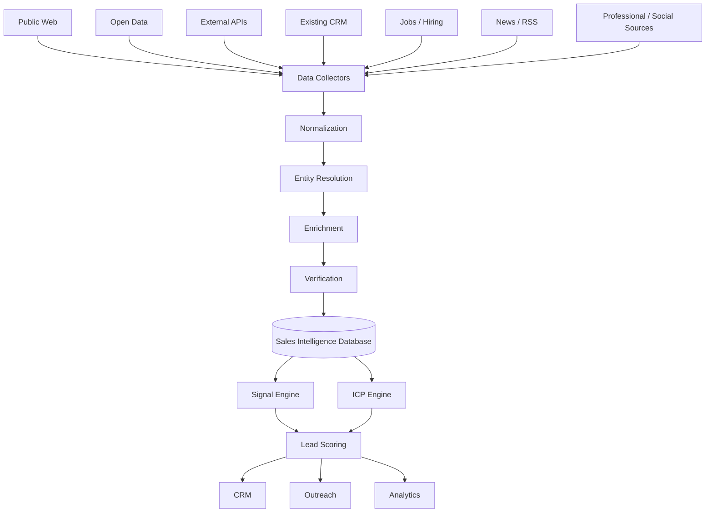
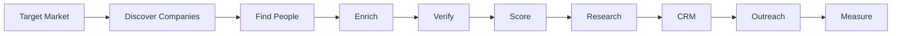
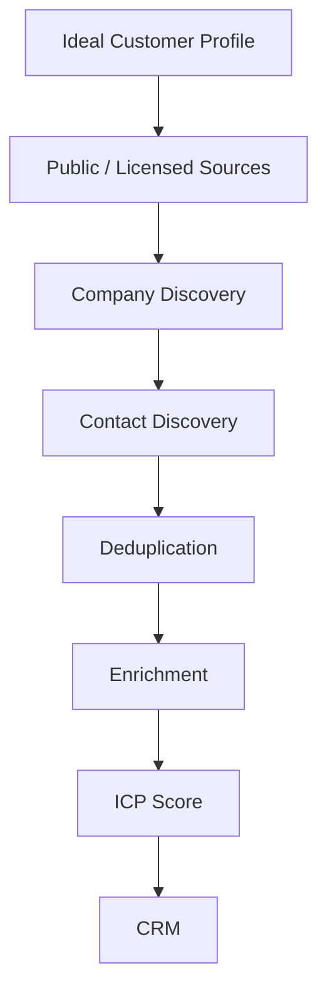
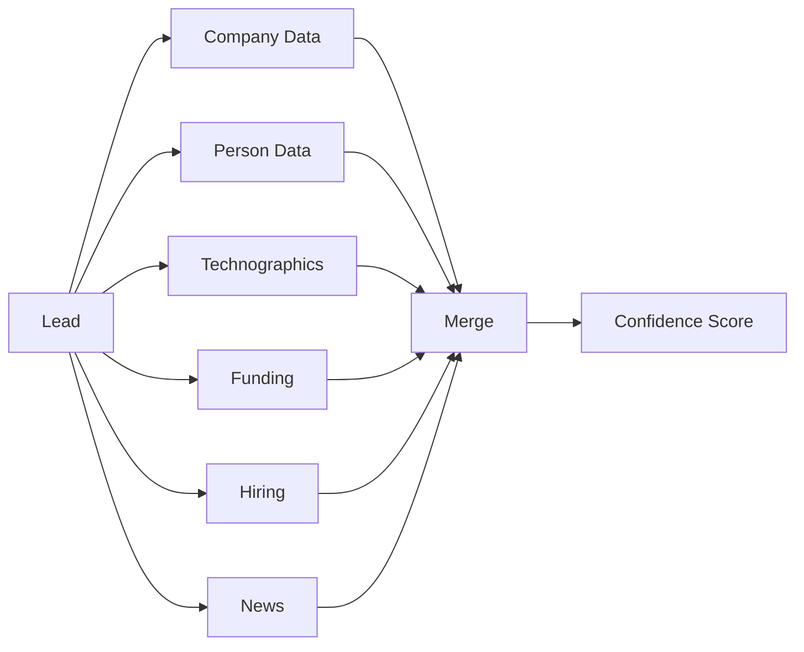
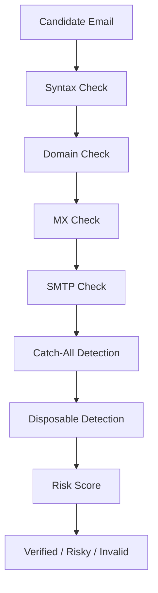
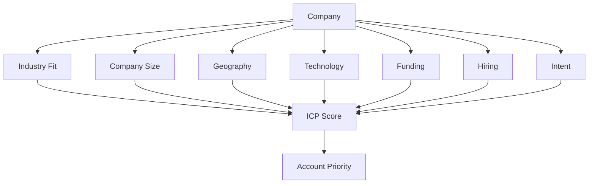
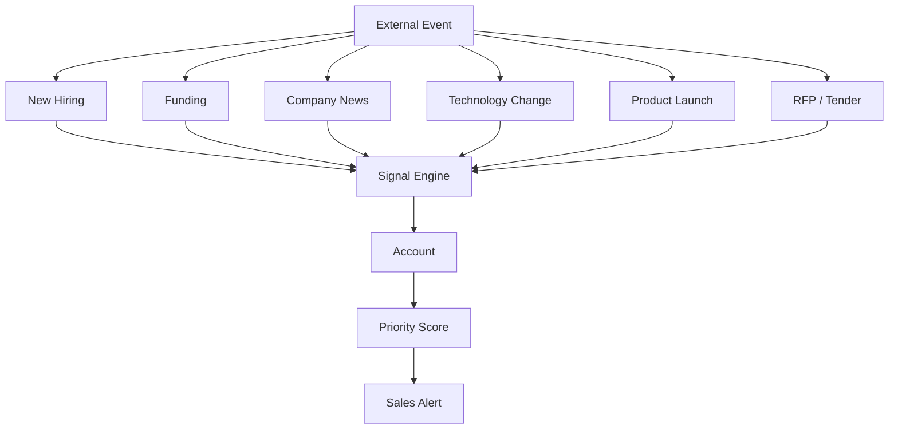
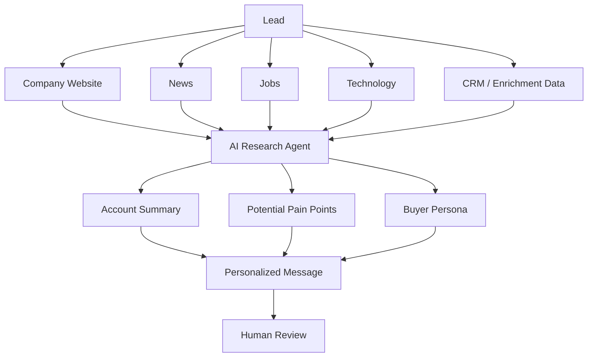
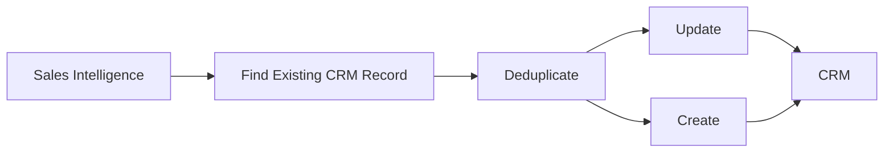

# Awesome-Sales-Intelligence

## Top Sales Intelligence Platforms


**A comprehensive ecosystem of B2B sales intelligence, prospecting, lead enrichment, contact discovery, company intelligence and open-source GTM platforms**


*Open-source-first reference covering sales intelligence, B2B databases, contact discovery, lead enrichment, email finding, company research, intent signals, prospecting, sales automation and the infrastructure required to build self-hosted alternatives.*


**Last updated: September 2026**


Sales Intelligence platforms help revenue teams discover, research, enrich, qualify and engage potential customers.


Typical capabilities include:


* B2B contact databases

* company databases

* contact discovery

* email finding

* email verification

* phone-number discovery

* company enrichment

* contact enrichment

* job-title and seniority data

* technographic data

* firmographic data

* intent signals

* job-change signals

* funding signals

* hiring signals

* website intelligence

* LinkedIn prospecting

* lead scoring

* ICP matching

* account research

* sales automation

* CRM enrichment

* outbound sequencing

* AI-assisted prospect research


Examples include **ZoomInfo, Apollo, Cognism, Lusha, LeadIQ, Seamless.AI, UpLead, Adapt.io, Kaspr and RocketReach**. Curated sales-tool directories similarly categorize these products around prospecting, contact databases and enrichment. ([awesome-lead-generation](https://github.com/dariubs/awesome-lead-generation))


The commercial sales-intelligence model generally looks like:


```text

Company Database

      +

People Database

      +

Contact Information

      +

Company Intelligence

      +

Intent / Buying Signals

      +

Enrichment

      +

Email Verification

      +

Prospecting

      +

CRM

      +

Outreach

```


The open-source ecosystem is different.


There are now projects explicitly positioning themselves as open-source alternatives to Apollo, ZoomInfo and Clay, including **SalesIQ, OpenLeads, KeeLead, OpenProspector, OpenGTM and LeadPipeline**. However, the quality and durability of their underlying data sources vary considerably. ([SalesIQ](https://github.com/SalesIQ/salesIQ-intelligence-community), [OpenLeads](https://github.com/Samyrrrrrr990/openleads), [KeeLead](https://github.com/Atum246/keelead), [OpenProspector](https://github.com/clawnify/OpenProspector), [OpenGTM](https://github.com/buildingopen/opengtm), [LeadPipeline](https://github.com/AI-Invention/lead-pipeline))


## Open-source emphasis


This README deliberately distinguishes between:


1. **Direct open-source sales-intelligence platforms**

2. **Open-source lead-discovery engines**

3. **Open-source enrichment platforms**

4. **Open-source CRM systems**

5. **Email discovery and verification components**

6. **Web/data extraction tools**

7. **LinkedIn/social prospecting infrastructure**

8. **Intent and signal collection**

9. **Workflow automation**

10. **AI-powered prospect research**

11. **Analytics and data infrastructure**


> **Important:** An open-source sales-intelligence application does not automatically provide a proprietary database comparable to ZoomInfo, Cognism or Apollo. The software can be open source while the underlying contact/company data still comes from public sources, APIs or separately licensed datasets.


This distinction is fundamental:


```text

OPEN-SOURCE SOFTWARE

        ≠

OPEN-SOURCE CONTACT DATABASE

```


A realistic self-hosted sales-intelligence platform may therefore look like:


```text

Public Web

   +

Open Data

   +

Licensed APIs

   +

Company Websites

   +

Professional Sources

   +

CRM Data

        ↓

Discovery

        ↓

Normalization

        ↓

Deduplication

        ↓

Enrichment

        ↓

Verification

        ↓

ICP Scoring

        ↓

CRM

        ↓

Outreach

```


---


## Table of Contents


* [SaaS/Hosted Platforms](#saashosted-platforms)

* [Open-Source Sales Intelligence Platforms](#open-source-sales-intelligence-platforms)

* [Open-Source Lead Discovery & Prospecting](#open-source-lead-discovery--prospecting)

* [Open-Source Lead Enrichment](#open-source-lead-enrichment)

* [Open-Source CRM Platforms](#open-source-crm-platforms)

* [Open-Source Email Discovery & Verification](#open-source-email-discovery--verification)

* [Open-Source Web & Data Extraction](#open-source-web--data-extraction)

* [Open-Source LinkedIn & Social Prospecting](#open-source-linkedin--social-prospecting)

* [Open-Source Intent & Buying-Signal Infrastructure](#open-source-intent--buying-signal-infrastructure)

* [Open-Source Workflow & GTM Automation](#open-source-workflow--gtm-automation)

* [Open-Source AI Sales Research](#open-source-ai-sales-research)

* [Open-Source Analytics & Data Infrastructure](#open-source-analytics--data-infrastructure)

* [Additional Strong Open-Source Options](#additional-strong-open-source-options)

* [Commercial Platform → Open-Source Equivalents](#commercial-platform--open-source-equivalents)

* [Frameworks for Building Custom Sales Intelligence Platforms](#frameworks-for-building-custom-sales-intelligence-platforms)

* [Reference Architecture](#reference-architecture)

* [Typical Sales Intelligence Workflow](#typical-sales-intelligence-workflow)

* [Lead Discovery Workflow](#lead-discovery-workflow)

* [Enrichment Workflow](#enrichment-workflow)

* [Email Verification Workflow](#email-verification-workflow)

* [ICP Scoring Workflow](#icp-scoring-workflow)

* [Buying Signal Workflow](#buying-signal-workflow)

* [AI Prospect Research Workflow](#ai-prospect-research-workflow)

* [CRM Synchronization Workflow](#crm-synchronization-workflow)

* [Capability Matrix](#capability-matrix)

* [Recommended Open-Source Stacks](#recommended-open-source-stacks)

* [What Is Still Difficult to Reproduce in Open Source?](#what-is-still-difficult-to-reproduce-in-open-source)

* [Why Open Source Is Interesting](#why-open-source-is-interesting)

* [How to Contribute](#how-to-contribute)

* [Disclaimer](#disclaimer)


---


# SaaS/Hosted Platforms


These are commercial, hosted or enterprise-oriented sales-intelligence and prospecting platforms.


| Platform                                            | Primary Model                 | Main Strength                            |

| --------------------------------------------------- | ----------------------------- | ---------------------------------------- |

| [ZoomInfo](https://www.zoominfo.com/)               | Enterprise sales intelligence | Large B2B data + intent                  |

| [Apollo](https://www.apollo.io/)                    | Prospecting + engagement      | Database + outbound sequencing           |

| [Cognism](https://www.cognism.com/)                 | B2B intelligence              | Global contact data + phone intelligence |

| [Lusha](https://www.lusha.com/)                     | Prospecting                   | Contact/company enrichment               |

| [LeadIQ](https://leadiq.com/)                       | Prospecting                   | LinkedIn prospecting + CRM enrichment    |

| [Seamless.AI](https://seamless.ai/)                 | Contact intelligence          | Real-time contact discovery              |

| [UpLead](https://www.uplead.com/)                   | B2B database                  | Verified B2B contacts                    |

| [Adapt.io](https://www.adapt.io/)                   | Lead database                 | Contact/company discovery                |

| [Kaspr](https://kaspr.io/)                          | LinkedIn prospecting          | LinkedIn contact discovery               |

| [RocketReach](https://rocketreach.co/)              | Contact lookup                | Person/company lookup                    |

| [Clay](https://www.clay.com/)                       | Data enrichment               | Multi-provider enrichment workflows      |

| [Hunter](https://hunter.io/)                        | Email intelligence            | Email discovery + verification           |

| [Clearbit](https://www.clearbit.com/)               | Enrichment                    | Company/person enrichment                |

| [6sense](https://6sense.com/)                       | Intent/ABM                    | Buying signals + account intelligence    |

| [Demandbase](https://www.demandbase.com/)           | ABM intelligence              | Account identification + intent          |

| [Lead411](https://www.lead411.com/)                 | Sales intelligence            | Contact data + intent                    |

| [LeadFuze](https://www.leadfuze.com/)               | Lead generation               | Automated prospect discovery             |

| [People Data Labs](https://www.peopledatalabs.com/) | Data API                      | Person/company datasets                  |

| [Crunchbase](https://www.crunchbase.com/)           | Company intelligence          | Companies + funding                      |

| [Dealroom](https://dealroom.co/)                    | Company intelligence          | Startups + funding + ecosystem           |

| [BuiltWith](https://builtwith.com/)                 | Technographics                | Technology-stack intelligence            |

| [Wappalyzer](https://www.wappalyzer.com/)           | Technographics                | Website technology detection             |

| [Similarweb](https://www.similarweb.com/)           | Web intelligence              | Traffic + digital signals                |

| [Bombora](https://bombora.com/)                     | Intent data                   | B2B intent signals                       |

| [Common Room](https://www.commonroom.io/)           | GTM intelligence              | Product/community signals                |

| [Leadfeeder](https://www.leadfeeder.com/)           | Website intelligence          | Anonymous visitor identification         |

| [6sense](https://6sense.com/)                       | Predictive intelligence       | Account intent + ABM                     |

| [PhantomBuster](https://phantombuster.com/)         | Prospecting automation        | Social/web automation                    |

| [Apify](https://apify.com/)                         | Data extraction               | Web scraping infrastructure              |


---


# Open-Source Sales Intelligence Platforms


This is the most important section for anyone trying to build a self-hosted alternative to ZoomInfo, Apollo, Cognism or RocketReach.


---


# 1. SalesIQ


[GitHub](https://github.com/SalesIQ/salesIQ-intelligence-community)


SalesIQ is an AI-powered open-source B2B sales-intelligence platform.


It combines:


* prospect discovery

* ICP scoring

* AI-assisted prospect research

* enrichment

* buying-signal detection

* email outreach

* LinkedIn workflows

* reply detection

* lightweight CRM/pipeline

* Pipedrive synchronization


Its community edition is licensed under AGPLv3 and can be self-hosted. ([GitHub](https://github.com/SalesIQ/salesIQ-intelligence-community))


Architecture:


```text

Prospect Search

      ↓

AI Research

      ↓

ICP Scoring

      ↓

Enrichment

      ↓

Signals

      ↓

Outreach

      ↓

Reply Detection

      ↓

CRM

```


This is one of the most interesting current projects for users looking for an **integrated open-source sales-intelligence application**.


---


# 2. OpenLeads


[GitHub](https://github.com/Samyrrrrrr990/openleads)


OpenLeads explicitly positions itself as an open-source alternative to Apollo, Hunter, RocketReach and ZoomInfo.


Its architecture focuses on:


* prospect discovery

* public-data aggregation

* person discovery

* email verification

* deduplication

* outreach


The project describes a federated discovery approach in which one search can fan out across multiple public data sources. ([GitHub](https://github.com/Samyrrrrrr990/openleads))


Conceptually:


```text

Natural Language Query

        ↓

Public Sources

        ↓

Company Discovery

        ↓

People Discovery

        ↓

Email Verification

        ↓

Deduplication

        ↓

Outreach

```


---


# 3. KeeLead


[GitHub](https://github.com/Atum246/keelead)


KeeLead is an open-source AI-powered lead-generation platform.


It advertises:


* 62 data sources

* company research

* lead discovery

* email verification

* AI functionality

* MCP support

* API keys for optional premium sources

* self-hosting


The project uses an important hybrid model:


```text

Open-Source Application

          +

Free Public Sources

          +

Optional Premium APIs

```


This makes it particularly interesting for building a **composable sales-intelligence stack**. ([GitHub](https://github.com/Atum246/keelead))


---


# 4. OpenProspector


[GitHub](https://github.com/clawnify/OpenProspector)


OpenProspector is an open-source lead-enrichment application designed around the idea of using the user's own provider keys rather than paying a data reseller markup.


Its architecture uses:


```text

React

+

Tailwind

+

Hono

+

SQLite

+

OpenAPI

```


It is positioned as an open-source Clay-style enrichment layer. ([GitHub](https://github.com/clawnify/OpenProspector))


---


# 5. OpenGTM


[GitHub](https://github.com/buildingopen/opengtm)


OpenGTM is an MIT-licensed open-source GTM platform combining:


* lead generation

* company research

* ICP scoring

* outreach

* CRM synchronization

* content/SEO workflows

* AI research


Its outbound pipeline is:


```text

Discover

   ↓

Research

   ↓

Qualify

   ↓

Message

   ↓

Outreach

   ↓

CRM

```


It uses AI and web-grounded research to generate sales prospects. ([GitHub](https://github.com/buildingopen/opengtm))


---


# 6. LeadPipeline


[GitHub](https://github.com/AI-Invention/lead-pipeline)


LeadPipeline is an MIT-licensed open-source sales pipeline that combines:


* lead scraping

* Google Maps discovery

* Google Sheets CRM

* personalized outreach

* reply tracking

* demo generation


Its architecture is:


```text

Scrape

  ↓

Enrich

  ↓

Pitch

  ↓

Demo

  ↓

Reply

  ↓

Close

```


It is especially useful for small-business and local-business prospecting. ([GitHub](https://github.com/AI-Invention/lead-pipeline))


---


# 7. Lead Research Agent


[GitHub](https://github.com/mcvalosborne/lead-research-agent)


An open-source AI-powered prospect research application.


Capabilities include:


* prospect discovery

* enrichment

* ICP scoring

* personalized messaging

* review before sending

* CSV export

* CRM synchronization


Its architecture is particularly useful for AI-assisted outbound research:


```text

Lead

 ↓

Enrichment

 ↓

Scoring

 ↓

Research

 ↓

Personalization

 ↓

Human Review

 ↓

CRM

```


([GitHub](https://github.com/mcvalosborne/lead-research-agent))


---


# 8. AI Sales Lead Enrichment & CRM Pipeline


[GitHub](https://github.com/Supreme-jay/ai-sales-lead-enrichment-crm-pipeline)


An open-source n8n-based workflow that demonstrates:


* lead intake

* AI company research

* pain-point identification

* lead scoring

* personalized outreach

* CRM storage

* sales alerts


It is useful as a reference architecture rather than a full ZoomInfo replacement. ([GitHub](https://github.com/Supreme-jay/ai-sales-lead-enrichment-crm-pipeline))


---


# Open-Source Lead Discovery & Prospecting


## Leadgen


[GitHub](https://github.com/Dukotah/leadgen)


Leadgen is a local-business lead-generation application using multiple public data sources.


Its pipeline is:


```text

Collect

 ↓

Deduplicate

 ↓

Enrich

 ↓

Suppress

 ↓

Score

 ↓

Export

```


It supports multiple public sources including OpenStreetMap, Overture, Foursquare, Socrata, NPI, ArcGIS and Wikidata. ([GitHub](https://github.com/Dukotah/leadgen))


---


## Lodgely


[GitHub](https://github.com/vidual-labs/lodgely)


Lodgely is an open-source lead-intake hub.


It accepts leads from:


* CSV

* email

* webhooks

* Google Sheets

* Meta Lead Ads

* forms

* manual entry


and provides:


* normalization

* deduplication

* lead review

* routing

* prioritization


It deliberately positions itself as the layer **before** a CRM rather than as a complete CRM. ([GitHub](https://github.com/vidual-labs/lodgely))


---


## Apify


[GitHub](https://github.com/apify/apify-cli)


Apify provides a powerful ecosystem for web-data extraction and automation.


It can serve as the acquisition layer:


```text

Web

 ↓

Apify Actor

 ↓

Structured Data

 ↓

Enrichment

 ↓

CRM

```


---


## Scrapy


[GitHub](https://github.com/scrapy/scrapy)


A mature Python web-crawling framework.


Useful for custom:


* company discovery

* website extraction

* contact-page discovery

* job-page extraction

* technology detection


---


## Crawlee


[GitHub](https://github.com/apify/crawlee)


Web-crawling framework useful for building scalable prospecting pipelines.


---


# Open-Source Lead Enrichment


## OpenProspector


One of the clearest open-source examples of a **provider-agnostic enrichment layer**.


```text

Lead

 ↓

Provider 1

 ↓

Provider 2

 ↓

Provider 3

 ↓

Merge

 ↓

Confidence Score

 ↓

CRM

```


---


## OpenGTM


Combines research, enrichment, ICP scoring and outbound workflows.


---


## KeeLead


Useful when a large number of heterogeneous data sources need to be combined.


---


## SalesIQ


Provides prospect research and enrichment as part of a broader sales-intelligence platform.


---


# Open-Source CRM Platforms


A sales-intelligence system needs somewhere to store the resulting intelligence.


## Twenty


[GitHub](https://github.com/twentyhq/twenty)


Modern open-source CRM.


Useful for:


* companies

* contacts

* opportunities

* activities

* custom objects

* workflows


---


## EspoCRM


[GitHub](https://github.com/espocrm/espocrm)


Mature open-source CRM.


---


## SuiteCRM


[GitHub](https://github.com/SuiteCRM/SuiteCRM)


Enterprise-oriented open-source CRM.


---


## Odoo Community


[GitHub](https://github.com/odoo/odoo)


Broad business platform with CRM functionality.


---


## ERPNext


[GitHub](https://github.com/frappe/erpnext)


Open-source ERP with:


* leads

* customers

* sales opportunities

* sales persons

* contacts


---


## Frappe CRM


[GitHub](https://github.com/frappe/crm)


Modern open-source CRM built on the Frappe ecosystem.


---


## Monica


[GitHub](https://github.com/monicahq/monica)


Primarily a personal CRM, but useful for contact-management patterns.


---


## Dolibarr


[GitHub](https://github.com/Dolibarr/dolibarr)


Open-source ERP/CRM.


---


# Open-Source Email Discovery & Verification


Email discovery is one of the most difficult pieces of a sales-intelligence platform.


## Email Finder / Discovery Building Blocks


Useful projects include:


* [theHarvester](https://github.com/laramies/theHarvester)

* [SpiderFoot](https://github.com/smicallef/spiderfoot)

* [PhoneInfoga](https://github.com/sundowndev/phoneinfoga)

* [Holehe](https://github.com/megadose/holehe)

* [GHunt](https://github.com/mxrch/GHunt)

* [Maigret](https://github.com/soxoj/maigret)

* [Sherlock](https://github.com/sherlock-project/sherlock)


These projects should be treated primarily as **OSINT/data-discovery components**, not as direct replacements for commercial verified B2B contact databases.


---


# Email Verification Infrastructure


Possible open-source building blocks include:


* [email-validator](https://github.com/JoshData/python-email-validator)

* [mailchecker](https://github.com/FGRibreau/mailchecker)

* SMTP-level verification logic

* DNS/MX validation

* disposable-email databases

* domain reputation services


A production email-verification platform generally requires:


```text

Syntax

 ↓

Domain

 ↓

MX

 ↓

SMTP

 ↓

Mailbox Risk

 ↓

Disposable Detection

 ↓

Catch-All Detection

 ↓

Confidence

```


---


# Open-Source Web & Data Extraction


## Scrapy


[GitHub](https://github.com/scrapy/scrapy)


Excellent for custom crawling.


## Crawlee


[GitHub](https://github.com/apify/crawlee)


Useful for scalable crawling.


## Playwright


[GitHub](https://github.com/microsoft/playwright)


Useful when websites require browser execution.


## Selenium


[GitHub](https://github.com/SeleniumHQ/selenium)


Browser automation and data extraction.


## Beautiful Soup


[GitHub](https://github.com/wention/BeautifulSoup4)


HTML parsing.


## trafilatura


[GitHub](https://github.com/adbar/trafilatura)


Useful for extracting clean web content.


## Newspaper


[GitHub](https://github.com/codelucas/newspaper)


Useful for extracting structured article/web content.


---


# Open-Source LinkedIn & Social Prospecting


This area requires particular caution.


Commercial products such as LeadIQ and Kaspr rely heavily on professional-network data and browser workflows.


Open-source projects include:


* [PhantomBuster](https://github.com/phantombuster)

* [TexAu](https://github.com/TexAu)

* [Apify](https://github.com/apify)

* [LinkenSphere-related tooling](https://github.com/)

* browser automation through [Playwright](https://github.com/microsoft/playwright)

* browser automation through [Selenium](https://github.com/SeleniumHQ/selenium)


A safer architecture is:


```text

Permitted Source

      ↓

Collection

      ↓

Normalization

      ↓

Enrichment

      ↓

CRM

```


> **Important:** Always comply with the applicable website's terms, robots policies, privacy laws, contractual restrictions and data-protection requirements. Open-source software does not make unauthorized scraping or use of personal data permissible.


---


# Open-Source Intent & Buying-Signal Infrastructure


Sales intelligence increasingly depends on **signals** rather than static contact lists.


Useful signal sources include:


```text

Funding

Hiring

Job Changes

Website Changes

Technology Changes

Product Launches

News

RFPs

Government Tenders

GitHub Activity

Company Growth

Website Visits

Community Activity

```


---


# GitHub Signals


[GitHub](https://github.com/)


Possible signals:


```text

New Repository

New Developer

Technology Adoption

Open-source Project

Issue Activity

Release

Star Growth

```


---


# Job Signals


A custom crawler can monitor:


```text

Company Careers Page

        ↓

New Job

        ↓

Department

        ↓

Technology

        ↓

Hiring Signal

```


Example:


```text

Company starts hiring

      ↓

"Head of Data"

      ↓

Potential data-platform initiative

      ↓

Account becomes higher priority

```


---


# Funding Signals


Possible sources:


* Crunchbase

* public company announcements

* SEC filings

* government records

* company press releases

* startup databases

* RSS feeds


Open-source components can monitor these sources and create events.


---


# RSS / News Signals


Use:


* RSS

* Atom

* GDELT

* Common Crawl

* website feeds

* news APIs


Architecture:


```text

News

 ↓

Entity Extraction

 ↓

Company Matching

 ↓

Signal

 ↓

Account Score

```


---


# Open-Source GTM Automation


## n8n


[GitHub](https://github.com/n8n-io/n8n)


Excellent for connecting:


```text

Lead Source

 ↓

Enrichment

 ↓

AI Research

 ↓

Scoring

 ↓

CRM

 ↓

Outreach

```


---


## Node-RED


[GitHub](https://github.com/node-red/node-red)


Useful for event-driven GTM workflows.


---


## Temporal


[GitHub](https://github.com/temporalio/temporal)


Useful for reliable long-running workflows.


Example:


```text

Find Lead

 ↓

Enrich

 ↓

Verify

 ↓

Wait

 ↓

Research

 ↓

Score

 ↓

Human Approval

 ↓

Send

 ↓

Track Reply

```


---


## Windmill


[GitHub](https://github.com/windmill-labs/windmill)


Open-source workflow/developer automation platform useful for custom sales-data pipelines.


---


## Kestra


[GitHub](https://github.com/kestra-io/kestra)


Useful for orchestrating data-heavy GTM workflows.


---


# Open-Source AI Sales Research


AI can dramatically reduce the difference between a raw contact database and a useful sales-intelligence platform.


Potential open-source components include:


## Ollama


[GitHub](https://github.com/ollama/ollama)


Local LLM execution.


## vLLM


[GitHub](https://github.com/vllm-project/vllm)


High-performance inference server.


## LlamaIndex


[GitHub](https://github.com/run-llama/llama_index)


Useful for connecting AI models to company/lead data.


## LangChain


[GitHub](https://github.com/langchain-ai/langchain)


Useful for building research agents and workflows.


## Haystack


[GitHub](https://github.com/deepset-ai/haystack)


Useful for retrieval and AI research pipelines.


---


# AI Prospect Research Architecture


```text

Company

   ↓

Website

   ↓

Products

   ↓

Industry

   ↓

Technology

   ↓

Hiring

   ↓

Funding

   ↓

News

   ↓

AI Research Agent

   ↓

ICP Fit

   ↓

Pain Points

   ↓

Personalized Message

```


---


# Open-Source Analytics & Data Infrastructure


## PostgreSQL


[GitHub](https://github.com/postgres/postgres)


Primary transactional database.


## ClickHouse


[GitHub](https://github.com/ClickHouse/ClickHouse)


Excellent for large-scale sales/event analytics.


## DuckDB


[GitHub](https://github.com/duckdb/duckdb)


Excellent for local analytical processing.


## Apache Spark


[GitHub](https://github.com/apache/spark)


Large-scale data processing.


## Apache Kafka


[GitHub](https://github.com/apache/kafka)


Event streaming.


## Redis


[GitHub](https://github.com/redis/redis)


Caching, queues and real-time state.


## MinIO


[GitHub](https://github.com/minio/minio)


Object storage.


## OpenSearch


[GitHub](https://github.com/opensearch-project/OpenSearch)


Search and analytics.


---


# Additional Strong Open-Source Options


## Direct / Near-Direct Sales Intelligence


* [SalesIQ](https://github.com/SalesIQ/salesIQ-intelligence-community)

* [OpenLeads](https://github.com/Samyrrrrrr990/openleads)

* [KeeLead](https://github.com/Atum246/keelead)

* [OpenProspector](https://github.com/clawnify/OpenProspector)

* [OpenGTM](https://github.com/buildingopen/opengtm)

* [LeadPipeline](https://github.com/AI-Invention/lead-pipeline)

* [Lead Research Agent](https://github.com/mcvalosborne/lead-research-agent)


## Lead Discovery


* [Leadgen](https://github.com/Dukotah/leadgen)

* [Lodgely](https://github.com/vidual-labs/lodgely)

* [Scrapy](https://github.com/scrapy/scrapy)

* [Crawlee](https://github.com/apify/crawlee)

* [Apify](https://github.com/apify/apify-cli)


## CRM


* [Twenty](https://github.com/twentyhq/twenty)

* [Frappe CRM](https://github.com/frappe/crm)

* [EspoCRM](https://github.com/espocrm/espocrm)

* [SuiteCRM](https://github.com/SuiteCRM/SuiteCRM)

* [Odoo](https://github.com/odoo/odoo)

* [ERPNext](https://github.com/frappe/erpnext)

* [Dolibarr](https://github.com/Dolibarr/dolibarr)


## OSINT / Discovery


* [theHarvester](https://github.com/laramies/theHarvester)

* [SpiderFoot](https://github.com/smicallef/spiderfoot)

* [Sherlock](https://github.com/sherlock-project/sherlock)

* [Maigret](https://github.com/soxoj/maigret)

* [GHunt](https://github.com/mxrch/GHunt)

* [Holehe](https://github.com/megadose/holehe)

* [PhoneInfoga](https://github.com/sundowndev/phoneinfoga)


## Automation


* [n8n](https://github.com/n8n-io/n8n)

* [Node-RED](https://github.com/node-red/node-red)

* [Temporal](https://github.com/temporalio/temporal)

* [Windmill](https://github.com/windmill-labs/windmill)

* [Kestra](https://github.com/kestra-io/kestra)


## AI


* [Ollama](https://github.com/ollama/ollama)

* [vLLM](https://github.com/vllm-project/vllm)

* [LlamaIndex](https://github.com/run-llama/llama_index)

* [LangChain](https://github.com/langchain-ai/langchain)

* [Haystack](https://github.com/deepset-ai/haystack)


---


# Commercial Platform → Open-Source Equivalents


| Commercial / Hosted Platform   | Closest Open-Source Options                         | Notes                                                                |

| ------------------------------ | --------------------------------------------------- | -------------------------------------------------------------------- |

| **ZoomInfo**                   | SalesIQ + OpenSearch + OpenGTM + CRM                | Strong application layer; proprietary database remains the major gap |

| **Apollo**                     | OpenLeads + SalesIQ + OpenGTM + Twenty              | Strongest open-source direction for prospecting + outreach           |

| **Cognism**                    | KeeLead + OpenProspector + licensed/public data     | Phone-verified global data remains difficult to reproduce            |

| **Lusha**                      | OpenLeads + OpenProspector + OSINT tools            | Contact discovery requires external data                             |

| **LeadIQ**                     | SalesIQ + OpenLeads + browser automation            | Prospect capture/enrichment architecture                             |

| **Seamless.AI**                | KeeLead + OpenGTM + enrichment providers            | AI-assisted discovery can be reproduced; database scale is harder    |

| **UpLead**                     | OpenLeads + OpenProspector + email verification     | Verified B2B database requires external sources                      |

| **Adapt.io**                   | KeeLead + OpenProspector + CRM                      | Similar composable architecture                                      |

| **Kaspr**                      | SalesIQ + Playwright + permitted data sources       | LinkedIn-centric functionality needs careful compliance              |

| **RocketReach**                | OpenLeads + OSINT + email verification              | Person lookup can be approximated with multiple sources              |

| **Clay**                       | OpenProspector + n8n + OpenGTM                      | Multi-provider enrichment/waterfall model                            |

| **Hunter**                     | Open-source email discovery + verification stack    | Email verification quality is the key challenge                      |

| **6sense**                     | OpenGTM + signal pipeline + ML                      | Intent modeling requires significant data                            |

| **Demandbase**                 | OpenSearch + signal engine + CRM + ML               | ABM intelligence requires account-level data                         |

| **Leadfeeder**                 | Web analytics + reverse-IP provider + CRM           | Identity resolution is the major challenge                           |

| **BuiltWith**                  | Wappalyzer + custom crawlers                        | Technographic discovery                                              |

| **Wappalyzer**                 | Wappalyzer + custom detection rules                 | Strong open-source technology detection foundation                   |

| **Crunchbase**                 | Public company datasets + OpenGTM + custom crawlers | Funding/company data requires source integration                     |

| **Generic Sales Intelligence** | SalesIQ + OpenLeads + OpenProspector + Twenty       | Strong open-source starting point                                    |


---


# Frameworks for Building Custom Sales Intelligence Platforms


A complete open-source sales-intelligence platform can be assembled from several layers.


## 1. Data Acquisition


Potential sources:


```text

Company Websites

Job Boards

Government Data

Open Data

RSS

News

GitHub

Public APIs

CRM

Licensed APIs

Web Crawlers

```


---


# 2. Entity Discovery


The system identifies:


```text

Company

Person

Domain

Email

Phone

Technology

Industry

Location

Job

Funding

Event

```


---


# 3. Entity Resolution


This is critical.


Example:


```text

Acme Inc.

Acme Corporation

Acme Technologies

Acme AI


        ↓


     Same Company

```


Open-source technologies useful here include:


* PostgreSQL

* Elasticsearch/OpenSearch

* RapidFuzz

* Splink

* dedupe

* recordlinkage


---


# 4. Enrichment


```text

Company

   ↓

Industry

   ↓

Employees

   ↓

Revenue

   ↓

Technology

   ↓

Funding

   ↓

Locations

   ↓

Contacts

```


Then:


```text

Person

   ↓

Title

   ↓

Seniority

   ↓

Department

   ↓

Email

   ↓

Phone

   ↓

Social Profile

```


---


# 5. Data Confidence


Every enrichment field should ideally have:


```text

Value

+

Source

+

Timestamp

+

Confidence

```


Example:


```json

{

  "company_size": {

    "value": "201-500",

    "source": "company_website",

    "timestamp": "2026-09-09",

    "confidence": 0.91

  }

}

```


This is much better than treating all data as equally reliable.


---


# 6. ICP Engine


The system should translate:


```text

Ideal Customer Profile

```


into machine-readable rules.


Example:


```text

Industry = SaaS

Employees = 100-1000

Region = Europe

Technology = Salesforce

Funding = Series B+

Hiring = Sales

```


Then:


```text

Company

   ↓

ICP Engine

   ↓

Fit Score

```


---


# 7. Lead Scoring


Example:


```text

Industry Fit        +25

Company Size        +20

Technology Fit      +15

Funding             +10

Hiring Signal       +10

Intent Signal       +10

Seniority           +10

                    ----

                     100

```


Result:


```text

90-100 = A+

75-89  = A

60-74  = B

40-59  = C

<40    = Low Priority

```


---


# 8. Signal Engine


A modern sales-intelligence system should calculate:


```text

Static Fit

+

Dynamic Signals

=

Account Priority

```


Example:


```text

Good ICP

+

Raised Funding

+

Hiring Salespeople

+

Adopted Salesforce

+

Visited Pricing Page

=

HIGH PRIORITY

```


---


# 9. Contact Discovery


A contact can be discovered through:


```text

Company

 ↓

Department

 ↓

Job Title

 ↓

Person

 ↓

Email

 ↓

Verification

```


---


# 10. Email Verification


A production workflow:


```text

Email Candidate

      ↓

Syntax

      ↓

Domain

      ↓

MX

      ↓

SMTP

      ↓

Catch-All

      ↓

Disposable

      ↓

Risk Score

      ↓

Verified / Unknown / Invalid

```


---


# 11. CRM Synchronization


```text

Sales Intelligence

       ↓

Deduplicate

       ↓

Normalize

       ↓

Match Existing CRM

       ↓

Create / Update

       ↓

CRM

```


Potential CRMs:


* Twenty

* Frappe CRM

* EspoCRM

* SuiteCRM

* Odoo

* ERPNext


---


# Reference Architecture





---


# Typical Sales Intelligence Workflow





---


# Lead Discovery Workflow





---


# Enrichment Workflow





---


# Email Verification Workflow





---


# ICP Scoring Workflow





---


# Buying Signal Workflow





---


# AI Prospect Research Workflow





---


# CRM Synchronization Workflow





---


# Sales Intelligence Data Model


A useful system should model at least:


```text

Company

Person

Domain

Email

Phone

Job

Technology

Funding

Event

Signal

Interaction

Account

Opportunity

```


Relationship:


```text

Company

  │

  ├── Domain

  ├── Technology

  ├── Funding

  ├── Jobs

  ├── Signals

  │

  └── People

        │

        ├── Email

        ├── Phone

        ├── Job

        └── Social Profile

```


---


# Company Intelligence Model


```json

{

  "company": "Example Corp",

  "domain": "example.com",

  "industry": "SaaS",

  "employees": 250,

  "location": "London",

  "technologies": [

    "Salesforce",

    "AWS",

    "HubSpot"

  ],

  "funding_stage": "Series B",

  "hiring": true,

  "signals": [

    "Hiring VP Sales",

    "Raised funding",

    "Expanded into Germany"

  ]

}

```


---


# Contact Intelligence Model


```json

{

  "name": "Jane Doe",

  "company": "Example Corp",

  "title": "VP Sales",

  "seniority": "Executive",

  "department": "Sales",

  "email": "jane@example.com",

  "email_status": "verified",

  "location": "London",

  "source": "company_website",

  "last_verified": "2026-09-09"

}

```


---


# Data Provenance


Every important data point should ideally contain:


```text

Value

+

Source

+

Timestamp

+

Confidence

+

License / Usage Context

```


Example:


```text

Employee Count

    ↓

Source: Company Website

    ↓

Collected: 2026-09-09

    ↓

Confidence: 0.92

```


This is particularly important when replacing commercial databases.


---


# Sales Intelligence Confidence Model


```text

Confidence =

Source Quality

+

Recency

+

Cross-Source Agreement

+

Verification

```


Example:


```text

Company Website

      +

Government Registry

      +

LinkedIn-like Professional Source

      +

Commercial API

      ↓

High Confidence

```


---


# Intent Scoring


A useful account score might be:


```text

ICP Fit                 +30

Hiring Signal           +15

Funding Signal          +15

Technology Fit          +10

Website Intent          +15

News Signal             +5

Engagement              +10

                         ---

                         100

```


Example:


```text

Score > 80

    ↓

Hot Account


Score 60-79

    ↓

High Priority


Score 40-59

    ↓

Nurture


Score < 40

    ↓

Low Priority

```


---


# Open-Source Sales Intelligence Stack: Minimal


```text

Twenty

  +

OpenGTM

  +

n8n

```


Best for:


* small sales teams

* founders

* technical GTM teams

* self-hosted CRM + prospecting


---


# Open-Source Sales Intelligence Stack: Prospecting


```text

OpenLeads

   +

KeeLead

   +

OpenProspector

   +

Twenty

```


Best for:


* contact discovery

* enrichment

* prospect research

* CRM synchronization


---


# Open-Source Sales Intelligence Stack: AI-First


```text

SalesIQ

   +

Ollama / vLLM

   +

OpenSearch

   +

Twenty

   +

n8n

```


Best for:


* AI-assisted research

* ICP scoring

* personalized outreach

* account intelligence


---


# Open-Source Sales Intelligence Stack: Data-Engineering


```text

Scrapy

   +

Crawlee

   +

Kafka

   +

PostgreSQL

   +

ClickHouse

   +

OpenSearch

   +

Twenty

```


Best for:


* large datasets

* custom company databases

* high-volume crawling

* data engineering teams


---


# Open-Source Sales Intelligence Stack: Full GTM


```text

                    DATA SOURCES

                         │

       ┌─────────────────┼──────────────────┐

       ↓                 ↓                  ↓

    Open Data          Web                APIs

       │                 │                  │

       └─────────────────┼──────────────────┘

                         ↓

                  Scrapy / Crawlee

                         ↓

                     KeeLead

                         ↓

                  OpenProspector

                         ↓

                  Entity Resolution

                         ↓

                    PostgreSQL

                         ↓

              ┌──────────┼──────────┐

              ↓          ↓          ↓

             ICP       Signals     AI

              ↓          ↓          ↓

              └──────────┼──────────┘

                         ↓

                      Scoring

                         ↓

                       Twenty

                         ↓

                        n8n

                         ↓

                     Outreach

```


---


# Capability Matrix


| Capability         |      ZoomInfo |     Apollo |       Cognism |            Lusha |       LeadIQ |      RocketReach |     SalesIQ |   OpenLeads |         KeeLead |  OpenProspector |

| ------------------ | ------------: | ---------: | ------------: | ---------------: | -----------: | ---------------: | ----------: | ----------: | --------------: | --------------: |

| Company database   |             ✅ |          ✅ |             ✅ |                ✅ |            ✅ |                ✅ | Via sources | Via sources |     Via sources |     Via sources |

| Contact database   |             ✅ |          ✅ |             ✅ |                ✅ |            ✅ |                ✅ | Via sources | Via sources |     Via sources |   Via providers |

| Email discovery    |             ✅ |          ✅ |             ✅ |                ✅ |            ✅ |                ✅ |           ✅ |           ✅ |               ✅ |   Via providers |

| Email verification |             ✅ |          ✅ |             ✅ |                ✅ |            ✅ |                ✅ |           ✅ |           ✅ |               ✅ |   Via providers |

| Phone data         |             ✅ |          ✅ |        Strong |                ✅ |  Via sources |                ✅ | Via sources | Via sources |     Via sources |   Via providers |

| Enrichment         |             ✅ |          ✅ |             ✅ |                ✅ |            ✅ |                ✅ |           ✅ |           ✅ |               ✅ |               ✅ |

| ICP scoring        |             ✅ | Limited/AI |             ✅ |          Limited |      Limited |          Limited |           ✅ |     Limited |              AI |          Custom |

| Intent signals     |             ✅ |    Limited |             ✅ |          Limited |      Limited |          Limited |           ✅ |      Custom |          Custom |          Custom |

| Job signals        |             ✅ |          ✅ |             ✅ |          Limited |            ✅ |          Limited |           ✅ | Via sources |     Via sources |          Custom |

| AI research        |             ✅ |          ✅ |    Increasing |          Limited |            ✅ |          Limited |           ✅ |     Limited |               ✅ |          Custom |

| Outreach           | Via ecosystem |          ✅ | Via ecosystem | Via integrations |            ✅ | Via integrations |           ✅ |           ✅ | Via integration | Via integration |

| CRM                |  Integrations |   Built-in |  Integrations |     Integrations | Integrations |     Integrations | Lightweight |    External |        External |        External |

| Self-hosted        |             ❌ |          ❌ |             ❌ |                ❌ |            ❌ |                ❌ |           ✅ |           ✅ |               ✅ |               ✅ |

| Open source        |             ❌ |          ❌ |             ❌ |                ❌ |            ❌ |                ❌ |           ✅ |           ✅ |               ✅ |               ✅ |


---


# Recommended Open-Source Stacks


## 1. Best Overall Open-Source Sales Intelligence


```text

SalesIQ

+

OpenProspector

+

Twenty

+

n8n

+

PostgreSQL

```


Why:


```text

SalesIQ

 ↓

Prospecting + Signals + AI


OpenProspector

 ↓

Enrichment


Twenty

 ↓

CRM


n8n

 ↓

Automation


PostgreSQL

 ↓

Data

```


---


# 2. Best Apollo Alternative Architecture


```text

OpenLeads

+

SalesIQ

+

Twenty

+

n8n

+

Listmonk

```


Provides:


```text

Lead Discovery

+

Enrichment

+

Scoring

+

CRM

+

Automation

+

Outreach

```


---


# 3. Best ZoomInfo-Like Architecture


A true ZoomInfo replacement requires a much larger data-engineering stack:


```text

Public Data

+

Company Websites

+

Government Data

+

Professional Data

+

Job Data

+

Funding Data

+

Technology Data

+

Licensed APIs

        ↓

Entity Resolution

        ↓

Enrichment

        ↓

Verification

        ↓

Company Graph

        ↓

Contact Graph

        ↓

Intent

        ↓

Sales Intelligence

```


Recommended software:


```text

Scrapy

+

Crawlee

+

Kafka

+

PostgreSQL

+

ClickHouse

+

OpenSearch

+

KeeLead

+

OpenProspector

+

Twenty

```


---


# 4. Best RocketReach-Like Architecture


```text

OpenLeads

+

OSINT Discovery

+

Email Verification

+

OpenSearch

+

Twenty

```


Useful discovery tools:


```text

theHarvester

SpiderFoot

Sherlock

Maigret

GHunt

```


---


# 5. Best LeadIQ-Like Architecture


```text

Browser Extension

+

SalesIQ

+

OpenProspector

+

Twenty

+

n8n

```


Architecture:


```text

Prospect Page

     ↓

Capture

     ↓

Enrich

     ↓

Verify

     ↓

CRM

```


---


# 6. Best Cognism-Like Architecture


Cognism's value is particularly difficult to reproduce because high-quality international phone/contact data requires extensive data acquisition and verification.


A composable architecture:


```text

KeeLead

+

OpenProspector

+

Public / Licensed Data

+

Phone Verification

+

Entity Resolution

+

Twenty

```


---


# 7. Best Intent-Driven Stack


```text

OpenGTM

+

News/RSS

+

Job Feeds

+

GitHub

+

Website Signals

+

OpenSearch

+

ML

+

Twenty

```


---


# 8. Best AI-First GTM Stack


```text

SalesIQ

+

Ollama / vLLM

+

OpenSearch

+

Twenty

+

n8n

```


Workflow:


```text

ICP

 ↓

AI Prospect Search

 ↓

Research

 ↓

Enrichment

 ↓

Scoring

 ↓

Personalization

 ↓

CRM

 ↓

Human Approval

 ↓

Outreach

```


---


# What Is Still Difficult to Reproduce in Open Source?


Open-source software can reproduce much of the **functionality**, but the hardest part is reproducing the **data asset**.


---


# 1. Proprietary Contact Databases


This is the biggest gap.


ZoomInfo, Cognism, Apollo and similar companies derive significant value from:


```text

Millions / Hundreds of Millions

of

Person + Company Records

```


combined with:


```text

Continuous Refresh

+

Verification

+

Deduplication

+

Identity Resolution

+

Phone Data

+

Email Data

+

Job Changes

```


Open-source software cannot magically create that database.


---


# 2. Accurate Direct-Dial Phone Numbers


Phone intelligence is particularly difficult.


A commercial provider may have:


```text

Person

 ↓

Current Employer

 ↓

Current Role

 ↓

Direct Dial

 ↓

Mobile

 ↓

Country

 ↓

Verification

```


Reproducing this at scale requires significant data partnerships and verification infrastructure.


---


# 3. Email Verification at Scale


Email verification looks simple:


```text

name@company.com

```


but real-world verification must handle:


```text

Catch-All

Disposable

Role Accounts

Greylisting

SMTP Blocking

Temporary Errors

Accept-All Servers

Shared Mailboxes

```


Commercial accuracy therefore requires substantial infrastructure.


---


# 4. Data Freshness


A contact database becomes stale quickly.


Example:


```text

January

Jane Doe

VP Sales

Company A


        ↓


April

Jane Doe

CRO

Company B

```


A modern sales-intelligence system therefore requires:


```text

Continuous Monitoring

+

Job Change Detection

+

Company Change Detection

```


---


# 5. Identity Resolution


The same person may appear as:


```text

Jane Doe

Jane A. Doe

J. Doe

Jane Doe-Smith

```


and the same company may appear under:


```text

Acme

Acme Inc.

Acme Corporation

Acme Technologies Ltd.

```


A production database needs sophisticated entity resolution.


Useful open-source technologies include:


* Splink

* Dedupe

* RapidFuzz

* PostgreSQL

* OpenSearch


---


# 6. Intent Data


True buyer intent is difficult.


A useful system needs to distinguish:


```text

Company is researching something

```


from:


```text

Company is actually preparing to buy something

```


This usually requires:


```text

Behavioral Signals

+

Historical Data

+

Machine Learning

+

Context

```


---


# 7. Technographics


Knowing that:


```text

Company uses Salesforce

```


is useful.


But knowing:


```text

Company recently adopted Salesforce

```


is much more valuable.


That requires:


```text

Repeated Observation

+

Historical Snapshots

+

Technology Detection

```


---


# 8. Data Licensing


Open-source code does not automatically grant the right to redistribute collected data.


A complete system must distinguish:


```text

Software License

        ≠

Data License

        ≠

Website Terms

        ≠

Privacy Law

```


This is particularly important when collecting personal information.


---


# 9. Privacy & Compliance


A sales-intelligence platform may process:


```text

Name

Email

Phone

Job Title

Location

Employer

Professional Profile

```


Depending on jurisdiction, privacy obligations may include:


* GDPR

* CCPA/CPRA

* ePrivacy rules

* other data-protection laws


A self-hosted system still requires:


```text

Lawful Basis

+

Purpose Limitation

+

Data Minimization

+

Retention

+

Deletion

+

Access Controls

+

Auditability

```


---


# 10. Anti-Abuse / Platform Restrictions


Automated extraction from professional networks and websites may violate platform terms or create operational/legal risks.


Therefore:


> **Open-source prospecting infrastructure should be designed around permitted sources, APIs, licensed datasets and compliant collection practices.**


---


# Why Open Source Is Interesting


The biggest opportunity is not simply:


> **"Build an open-source ZoomInfo clone."**


The more interesting opportunity is:


> **Build a sovereign, composable sales-intelligence data platform.**


Instead of buying a closed database:


```text

Commercial Database

       ↓

Subscription

       ↓

Vendor API

       ↓

CRM

```


a company can build:


```text

Own Data

+

Public Data

+

Licensed Data

+

Own CRM

+

Own Signals

+

Own AI

       ↓

Own Sales Intelligence

```


---


# The Open-Source Sales Intelligence Model


```text

                DATA

                 │

     ┌───────────┼───────────┐

     ↓           ↓           ↓

 Public       Licensed      First-Party

 Data           APIs           Data

     │           │             │

     └───────────┼─────────────┘

                 ↓

             Discovery

                 ↓

          Entity Resolution

                 ↓

             Enrichment

                 ↓

             Verification

                 ↓

           Signal Detection

                 ↓

             ICP Scoring

                 ↓

          AI Research Agent

                 ↓

                CRM

                 ↓

              Outreach

```


---


# Best Open-Source Projects by Use Case


| Use Case                      | Recommended Projects             |

| ----------------------------- | -------------------------------- |

| Integrated sales intelligence | SalesIQ                          |

| Apollo-like prospecting       | OpenLeads, OpenGTM               |

| Lead enrichment               | OpenProspector, KeeLead          |

| AI GTM                        | OpenGTM, SalesIQ                 |

| Lead research                 | Lead Research Agent              |

| Local-business leads          | Leadgen                          |

| Lead intake                   | Lodgely                          |

| CRM                           | Twenty, Frappe CRM, EspoCRM      |

| Enterprise CRM                | SuiteCRM, Odoo                   |

| Web crawling                  | Scrapy, Crawlee                  |

| Browser automation            | Playwright, Selenium             |

| OSINT                         | SpiderFoot, theHarvester         |

| Person discovery              | Sherlock, Maigret                |

| Email discovery               | OSINT + domain intelligence      |

| Email verification            | email-validator + SMTP/DNS stack |

| Workflow automation           | n8n, Node-RED                    |

| Durable workflows             | Temporal                         |

| AI inference                  | Ollama, vLLM                     |

| AI research                   | LlamaIndex, LangChain, Haystack  |

| Search                        | OpenSearch                       |

| Analytics                     | ClickHouse, DuckDB               |

| Database                      | PostgreSQL                       |

| Streaming                     | Kafka                            |

| Object storage                | MinIO                            |

| CRM synchronization           | n8n, custom APIs                 |


---


# Practical Full Open-Source Sales Intelligence Stack


```text

                           DATA SOURCES

                                │

             ┌──────────────────┼──────────────────┐

             ↓                  ↓                  ↓

        Public Web          Open Data          Licensed APIs

             │                  │                  │

             └──────────────────┼──────────────────┘

                                ↓

                       Scrapy / Crawlee

                                ↓

                             KeeLead

                                ↓

                        OpenProspector

                                ↓

                       Entity Resolution

                                ↓

                            PostgreSQL

                                ↓

                     ┌──────────┼──────────┐

                     ↓          ↓          ↓

                  OpenSearch  ClickHouse  MinIO

                     │          │          │

                     └──────────┼──────────┘

                                ↓

                         Signal Engine

                                ↓

                          ICP Scoring

                                ↓

                         AI Research

                                ↓

                             Twenty

                                ↓

                              n8n

                                ↓

                       Sales Automation

```


---


# Sales Intelligence Maturity Model


```text

Level 1

---------

Contact Database


        ↓


Level 2

---------

Contact Enrichment


        ↓


Level 3

---------

Company Intelligence


        ↓


Level 4

---------

ICP Scoring


        ↓


Level 5

---------

Buying Signals


        ↓


Level 6

---------

Intent Intelligence


        ↓


Level 7

---------

AI Research


        ↓


Level 8

---------

Predictive Account Prioritization


        ↓


Level 9

---------

Autonomous GTM Intelligence

```


The key transition is from:


```text

Finding Contacts

```


to:


```text

Understanding Which Accounts

Are Most Likely to Buy

and Why.

```


---


# Recommended Open-Source Shortlist


## Tier 1 — Direct / Near-Direct Platforms


1. [SalesIQ](https://github.com/SalesIQ/salesIQ-intelligence-community)

2. [OpenLeads](https://github.com/Samyrrrrrr990/openleads)

3. [KeeLead](https://github.com/Atum246/keelead)

4. [OpenProspector](https://github.com/clawnify/OpenProspector)

5. [OpenGTM](https://github.com/buildingopen/opengtm)

6. [LeadPipeline](https://github.com/AI-Invention/lead-pipeline)


## Tier 2 — Lead Research


7. [Lead Research Agent](https://github.com/mcvalosborne/lead-research-agent)

8. [Leadgen](https://github.com/Dukotah/leadgen)

9. [Lodgely](https://github.com/vidual-labs/lodgely)


## Tier 3 — CRM


10. [Twenty](https://github.com/twentyhq/twenty)

11. [Frappe CRM](https://github.com/frappe/crm)

12. [EspoCRM](https://github.com/espocrm/espocrm)

13. [SuiteCRM](https://github.com/SuiteCRM/SuiteCRM)

14. [Odoo](https://github.com/odoo/odoo)

15. [ERPNext](https://github.com/frappe/erpnext)


## Tier 4 — Data Acquisition


16. [Scrapy](https://github.com/scrapy/scrapy)

17. [Crawlee](https://github.com/apify/crawlee)

18. [Playwright](https://github.com/microsoft/playwright)

19. [Selenium](https://github.com/SeleniumHQ/selenium)

20. [theHarvester](https://github.com/laramies/theHarvester)

21. [SpiderFoot](https://github.com/smicallef/spiderfoot)


## Tier 5 — Automation


22. [n8n](https://github.com/n8n-io/n8n)

23. [Node-RED](https://github.com/node-red/node-red)

24. [Temporal](https://github.com/temporalio/temporal)

25. [Windmill](https://github.com/windmill-labs/windmill)

26. [Kestra](https://github.com/kestra-io/kestra)


## Tier 6 — AI


27. [Ollama](https://github.com/ollama/ollama)

28. [vLLM](https://github.com/vllm-project/vllm)

29. [LlamaIndex](https://github.com/run-llama/llama_index)

30. [LangChain](https://github.com/langchain-ai/langchain)

31. [Haystack](https://github.com/deepset-ai/haystack)


---


# Open-Source vs Commercial Strategy


The fundamental difference is:


```text

COMMERCIAL SALES INTELLIGENCE

────────────────────────────────────

ZoomInfo

Apollo

Cognism

Lusha

LeadIQ

Seamless.AI

UpLead

Adapt.io

Kaspr

RocketReach


       ↓


Vendor-Owned Data

+

Vendor-Owned Infrastructure

+

Vendor-Managed Verification

+

Vendor-Managed Signals

```


versus:


```text

OPEN-SOURCE SALES INTELLIGENCE

────────────────────────────────────

SalesIQ

OpenLeads

KeeLead

OpenProspector

OpenGTM

Twenty

n8n

Scrapy

OpenSearch


       ↓


Your Data

+

Public Data

+

Licensed Data

+

Your Signals

+

Your Models

+

Your CRM

```


The commercial approach provides:


```text

Immediate Data Scale

+

Data Quality

+

Verification

+

Freshness

+

Support

+

Integrations

```


The open-source approach provides:


```text

Data Ownership

+

Self Hosting

+

Customization

+

No Application Vendor Lock-In

+

Composable Architecture

+

Model Choice

+

Infrastructure Control

```


---


# Conclusion


The sales-intelligence market has evolved from static contact databases into sophisticated **GTM intelligence platforms**.


The modern architecture is:


```text

DISCOVER

   ↓

ENRICH

   ↓

VERIFY

   ↓

UNDERSTAND

   ↓

SCORE

   ↓

DETECT SIGNALS

   ↓

RESEARCH

   ↓

PRIORITIZE

   ↓

OUTREACH

   ↓

LEARN

```


The commercial leaders — **ZoomInfo, Apollo, Cognism, Lusha, LeadIQ, Seamless.AI, UpLead, Adapt.io, Kaspr and RocketReach** — provide this as managed products with proprietary data assets.


The open-source ecosystem is now becoming increasingly interesting.


The most important current projects to evaluate are:


> **SalesIQ + OpenLeads + KeeLead + OpenProspector + OpenGTM + Twenty + n8n + Scrapy/Crawlee.**


Together, these can form the basis of a self-hosted sales-intelligence environment covering:


```text

Lead Discovery

+

Company Research

+

Contact Discovery

+

Enrichment

+

Email Verification

+

ICP Scoring

+

Buying Signals

+

AI Research

+

CRM

+

Outreach

```


The most important distinction, however, remains:


```text

OPEN-SOURCE SOFTWARE

        ≠

OPEN-SOURCE DATA

```


The software layer can increasingly be open source.


The underlying **high-quality, current, verified B2B data** remains the hardest asset to reproduce.


Therefore, the strongest architecture is:


```text

Open-Source Software

        +

Public / Open Data

        +

Licensed Data Where Necessary

        +

First-Party CRM Data

        +

AI

        +

Signal Detection

        ↓

SOVEREIGN SALES INTELLIGENCE

```


The most interesting opportunity is to build an open-source:


> **Sales Intelligence + Data Enrichment + GTM Intelligence Platform**


that lets organizations control:


```text

Code

+

Data

+

Models

+

Signals

+

Scoring

+

CRM

+

Infrastructure

```


rather than renting the entire intelligence layer from a single vendor.


---


# How to Contribute


Useful contributions include:


* adding sales-intelligence platforms

* adding open-source prospecting projects

* adding enrichment providers

* documenting data sources

* adding entity-resolution algorithms

* adding email-verification techniques

* adding company intelligence sources

* adding job-change signals

* adding funding signals

* adding technology-detection systems

* creating ICP-scoring examples

* adding AI prospect-research agents

* creating CRM integrations

* adding GTM workflows

* documenting compliant data-collection methods

* benchmarking enrichment pipelines

* adding privacy/compliance documentation

* creating self-hosted deployment guides

* adding data-quality benchmarks

* documenting source provenance


Pull requests are welcome.


---


# Disclaimer


This README is an ecosystem overview rather than a product endorsement, legal opinion, data-quality guarantee or recommendation to collect personal information from any particular source.


Open-source availability, licensing, project activity, supported integrations and features can change.


Before deploying an open-source sales-intelligence platform, evaluate:


* data provenance

* data licensing

* privacy laws

* website terms

* API terms

* consent requirements

* legitimate-interest requirements where applicable

* data retention

* deletion mechanisms

* opt-out handling

* suppression lists

* email deliverability

* phone-data accuracy

* data freshness

* entity resolution

* duplicate handling

* security

* access control

* audit logging

* encryption

* CRM synchronization

* infrastructure costs


**Open-source software does not automatically make sales-intelligence data collection lawful or compliant.**


In particular:


```text

Software License

        ≠

Data License

        ≠

Website Terms

        ≠

Privacy Permission

```


A production sales-intelligence platform should maintain:


```text

Source

+

Timestamp

+

Confidence

+

Provenance

+

Permitted Use

+

Retention Policy

```


> **The strongest open-source strategy is therefore not to build an uncontrolled scraper. It is to build a transparent, provenance-aware and composable intelligence platform that combines permitted data sources, open-source software, first-party information, licensed datasets and AI-assisted research.**


The ultimate objective is:


```text

More Relevant Accounts

        ↓

Better Intelligence

        ↓

Better Prioritization

        ↓

Better Conversations

        ↓

Better Sales Outcomes

```
